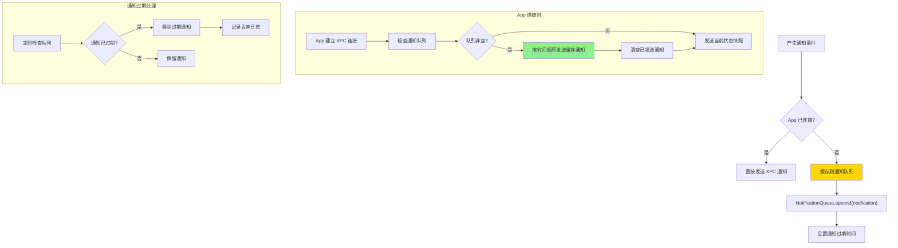
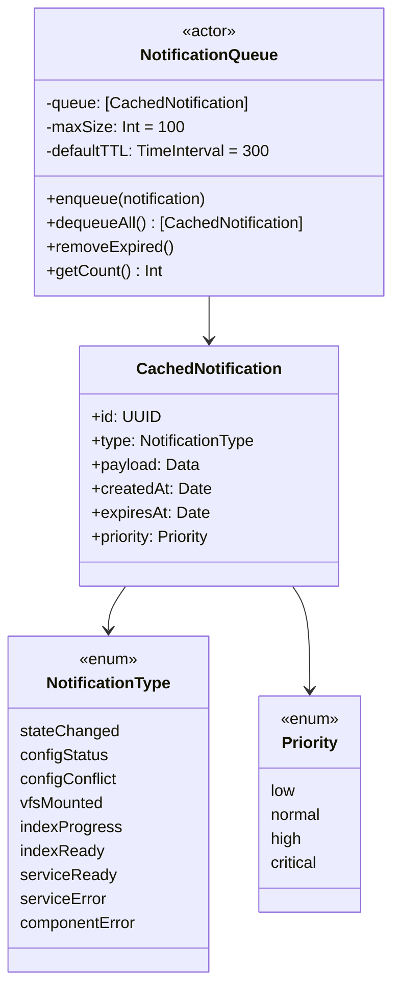
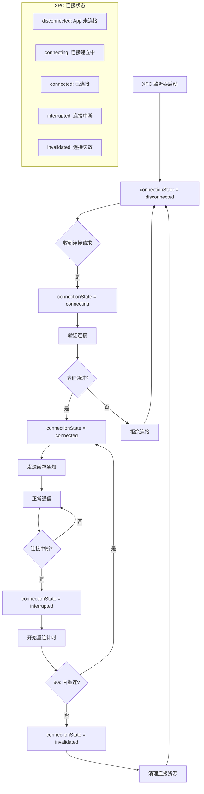
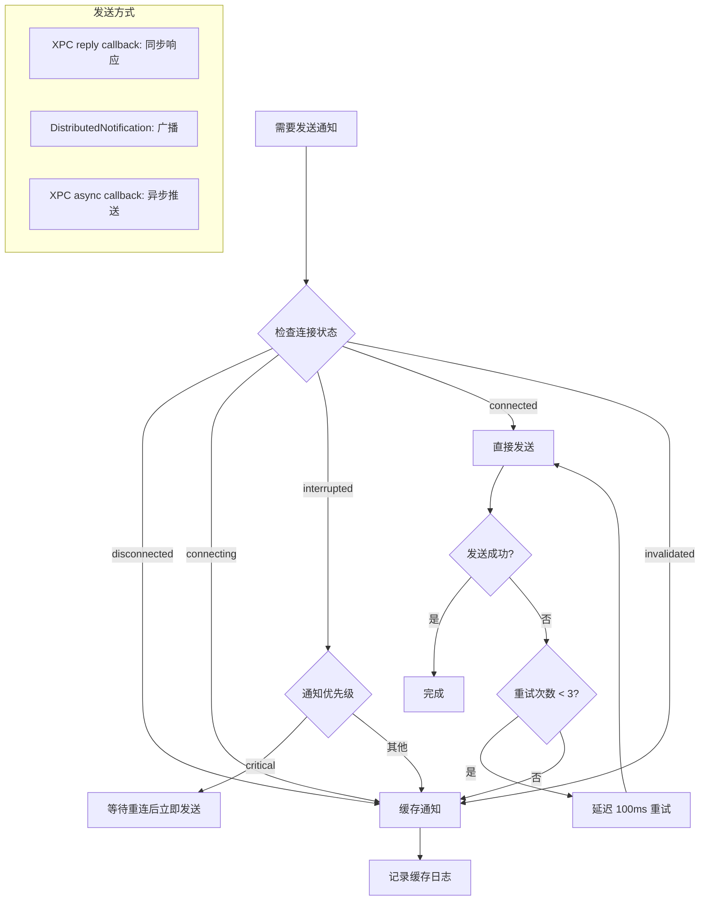

# 四、XPC 通信与通知机制

> 返回 [目录](00_README.md) | 上一节: [03_启动流程总览](03_启动流程总览.md)

---

## 4.1 通知缓存机制

```mermaid
flowchart TD
    A[产生通知事件] --> B{App 已连接?}

    B -->|是| C[直接发送 XPC 通知]
    B -->|否| D[缓存到通知队列]

    D --> E["NotificationQueue.append(notification)"]
    E --> F[设置通知过期时间]

    subgraph AppConnect["App 连接时"]
        G[App 建立 XPC 连接] --> H[检查通知队列]
        H --> I{队列非空?}
        I -->|是| J[按时间顺序发送缓存通知]
        I -->|否| K[发送当前状态快照]
        J --> L[清空已发送通知]
        L --> K
    end

    subgraph NotificationExpiry["通知过期处理"]
        M[定时检查队列] --> N{通知已过期?}
        N -->|是| O[移除过期通知]
        N -->|否| P[保留通知]
        O --> Q[记录丢弃日志]
    end

    style D fill:#FFD700
    style J fill:#90EE90
```

## 4.2 通知队列结构

```mermaid
classDiagram
    class NotificationQueue {
        <<actor>>
        -queue: [CachedNotification]
        -maxSize: Int = 100
        -defaultTTL: TimeInterval = 300
        +enqueue(notification)
        +dequeueAll() [CachedNotification]
        +removeExpired()
        +getCount() Int
    }

    class CachedNotification {
        +id: UUID
        +type: NotificationType
        +payload: Data
        +createdAt: Date
        +expiresAt: Date
        +priority: Priority
    }

    class NotificationType {
        <<enum>>
        stateChanged
        configStatus
        configConflict
        vfsMounted
        indexProgress
        indexReady
        serviceReady
        serviceError
        componentError
    }

    class Priority {
        <<enum>>
        low
        normal
        high
        critical
    }

    NotificationQueue --> CachedNotification
    CachedNotification --> NotificationType
    CachedNotification --> Priority
```

## 4.3 XPC 连接状态管理

```mermaid
flowchart TD
    subgraph ConnectionState["XPC 连接状态"]
        CS1["disconnected: App 未连接"]
        CS2["connecting: 连接建立中"]
        CS3["connected: 已连接"]
        CS4["interrupted: 连接中断"]
        CS5["invalidated: 连接失效"]
    end

    A[XPC 监听器启动] --> B["connectionState = disconnected"]

    B --> C{收到连接请求}
    C -->|是| D["connectionState = connecting"]
    D --> E[验证连接]
    E --> F{验证通过?}
    F -->|是| G["connectionState = connected"]
    F -->|否| H[拒绝连接]
    H --> B

    G --> I[发送缓存通知]
    I --> J[正常通信]

    J --> K{连接中断?}
    K -->|是| L["connectionState = interrupted"]
    L --> M[开始重连计时]
    M --> N{30s 内重连?}
    N -->|是| G
    N -->|否| O["connectionState = invalidated"]
    O --> P[清理连接资源]
    P --> B

    K -->|否| J
```

## 4.4 通知发送策略

```mermaid
flowchart TD
    A[需要发送通知] --> B{检查连接状态}

    B -->|disconnected| C[缓存通知]
    B -->|connecting| C
    B -->|interrupted| D{通知优先级}
    B -->|connected| E[直接发送]
    B -->|invalidated| C

    D -->|critical| F[等待重连后立即发送]
    D -->|其他| C

    E --> G{发送成功?}
    G -->|是| H[完成]
    G -->|否| I{重试次数 < 3?}
    I -->|是| J[延迟 100ms 重试]
    J --> E
    I -->|否| C

    C --> K[记录缓存日志]

    subgraph SendTypes["发送方式"]
        ST1["XPC reply callback: 同步响应"]
        ST2["DistributedNotification: 广播"]
        ST3["XPC async callback: 异步推送"]
    end
```

---

> 下一节: [05_状态管理器](05_状态管理器.md)
