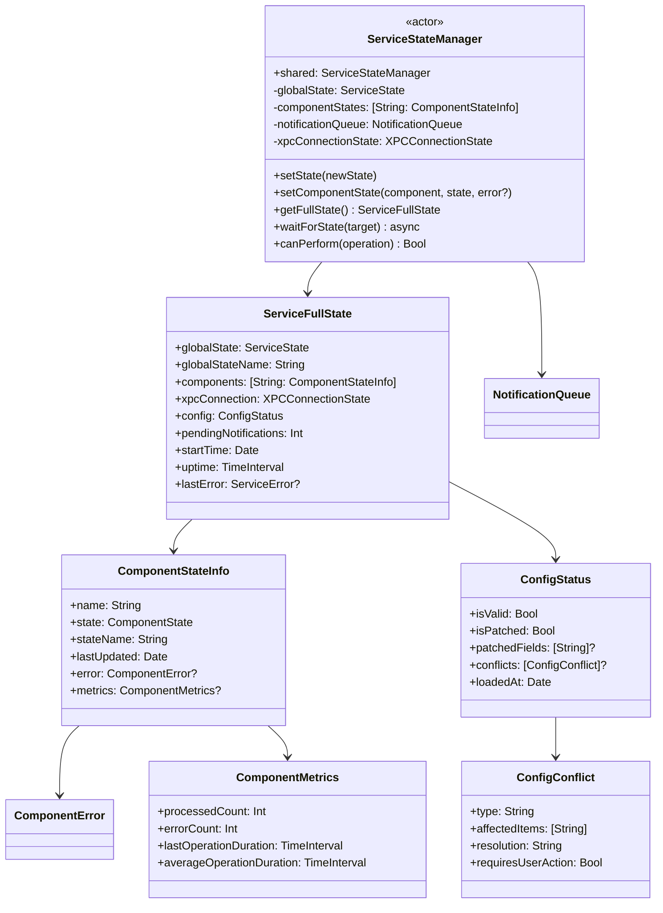
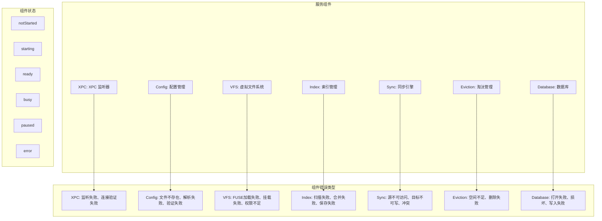
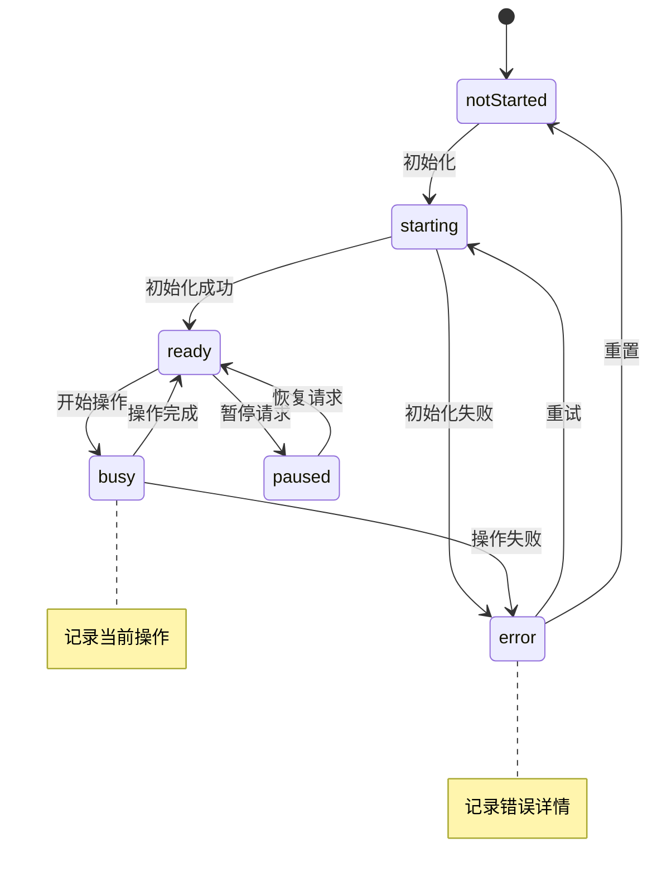
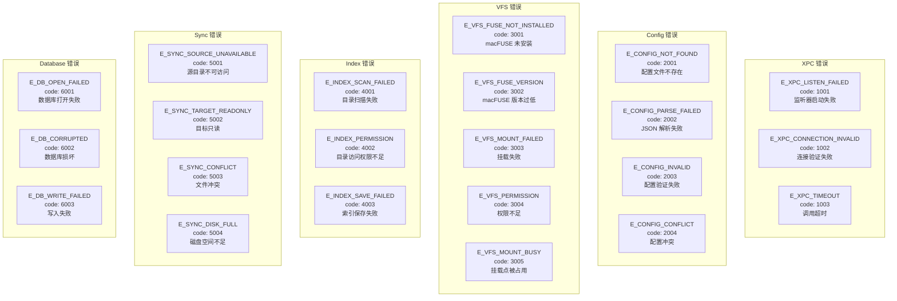
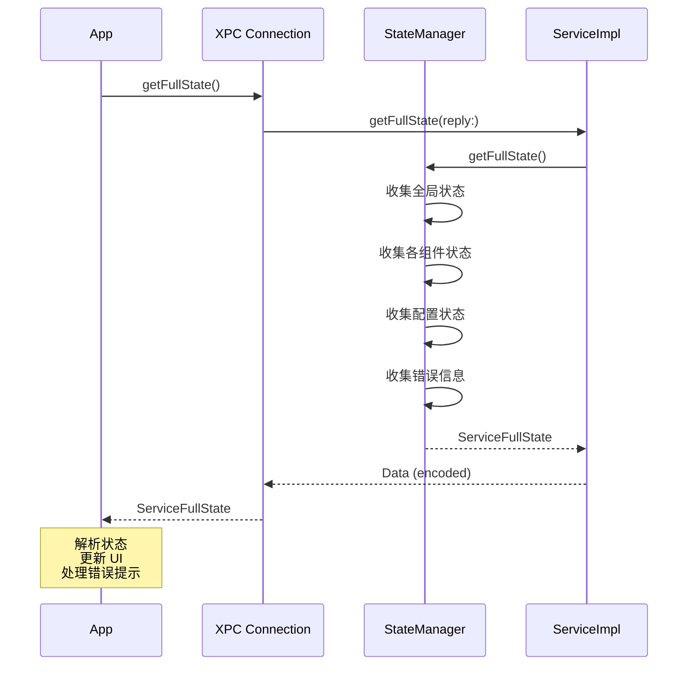

# 五、状态管理器设计

> 返回 [目录](00_README.md) | 上一节: [04_XPC通信与通知](04_XPC通信与通知.md)

---

## 5.1 完整状态结构

## 5.2 组件状态定义

## 5.3 组件状态转换

## 5.4 组件错误详情

## 5.5 状态查询接口

---

> 下一节: [06_XPC优先启动](06_XPC优先启动.md)
