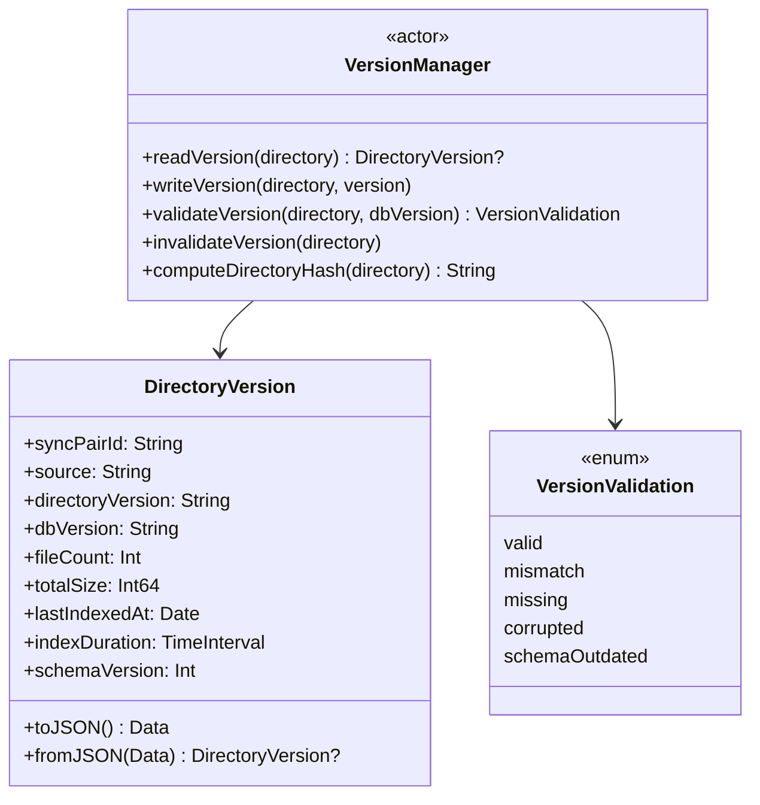
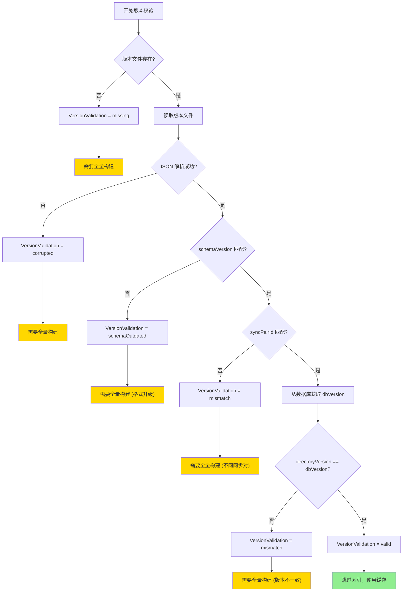
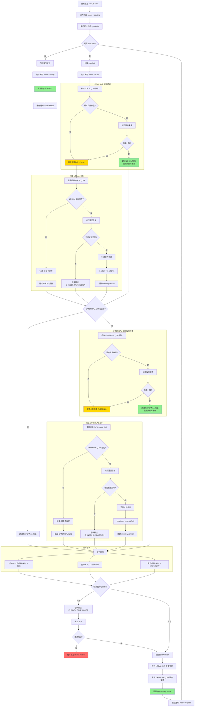
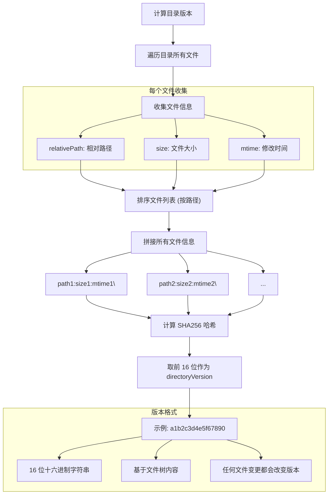
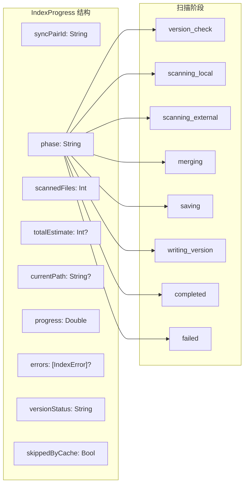

# 八、索引构建流程

> 返回 [目录](00_README.md) | 上一节: [07_VFS预挂载机制](07_VFS预挂载机制.md)

---

## 8.1 版本管理机制

### 8.1.1 版本文件结构

每个目录下存储版本文件 `.dmsa/version.json`：

```
LOCAL_DIR/                      # ~/Downloads_Local
└── .dmsa/
    └── version.json            # 本地目录版本文件

EXTERNAL_DIR/                   # /Volumes/DISK/Downloads
└── .dmsa/
    └── version.json            # 外部目录版本文件
```

### 8.1.2 版本文件内容

```swift
struct DirectoryVersion: Codable {
    let syncPairId: String          // 同步对 ID
    let source: String              // "local" 或 "external"
    let directoryVersion: String    // 目录内容版本 (基于文件树哈希)
    let dbVersion: String           // 数据库中对应的版本
    let fileCount: Int              // 文件数量
    let totalSize: Int64            // 总大小 (bytes)
    let lastIndexedAt: Date         // 最后索引时间
    let indexDuration: TimeInterval // 索引耗时
    let schemaVersion: Int          // 版本文件格式版本 (用于升级)
}
```



### 8.1.3 版本校验流程



---

## 8.2 索引构建主流程 (含版本检查)



---

## 8.3 版本计算方法



---

## 8.4 索引进度通知



---

## 8.5 各操作的版本更新策略

| 操作 | LOCAL 版本 | EXTERNAL 版本 | 更新时机 |
|------|------------|---------------|----------|
| **索引构建** | ✅ 更新 | ✅ 更新 | 构建完成后立即更新 |
| **文件同步** | ❌ 不变 | ✅ 更新 | 同步批次完成后更新 |
| **冲突解决 (keepLocal)** | ❌ 不变 | ✅ 更新 | 解决后立即更新 |
| **冲突解决 (keepExternal)** | ✅ 更新 | ❌ 不变 | 解决后立即更新 |
| **冲突解决 (keepBoth)** | ✅ 更新 | ✅ 更新 | 解决后立即更新 |
| **淘汰操作** | ✅ 更新 | ❌ 不变 | 淘汰批次完成后更新 |
| **VFS 写入** | ✅ 标记失效 | ❌ 不变 | 延迟更新 (下次同步时) |

---

> 下一节: [09_文件同步流程](09_文件同步流程.md)
