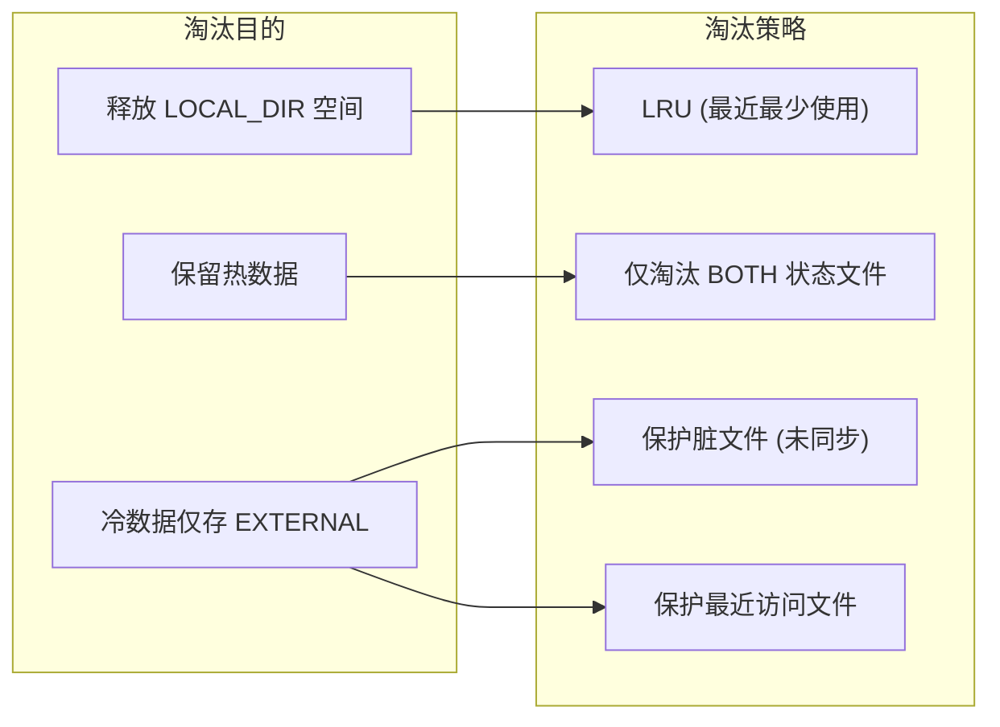
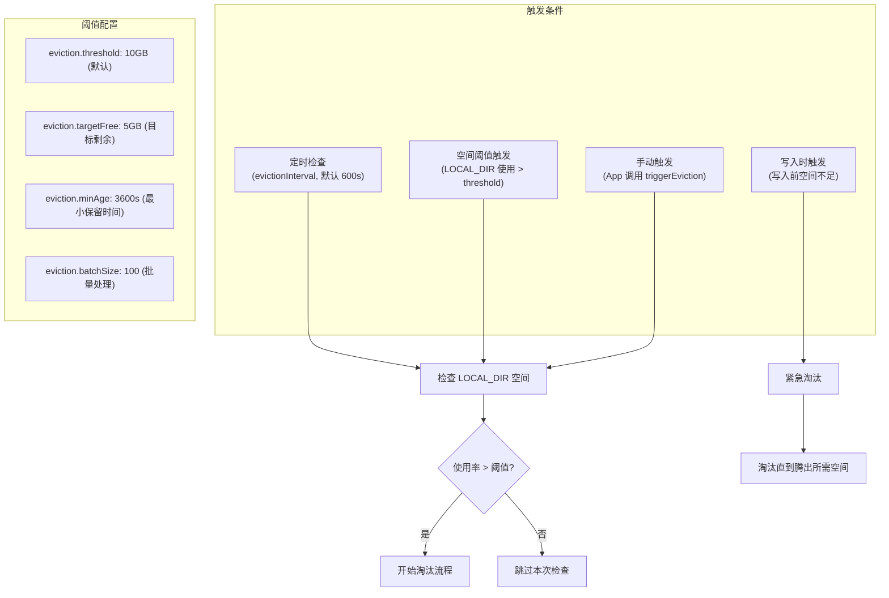
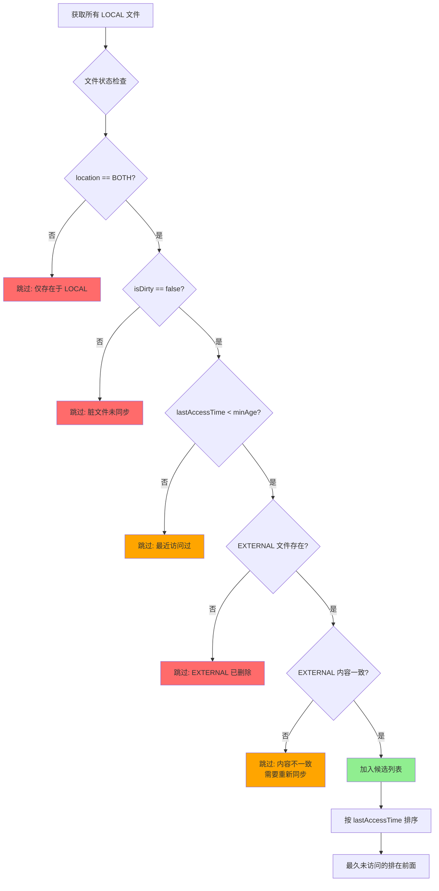
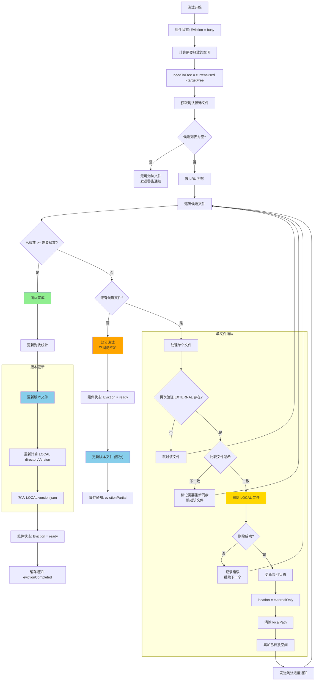
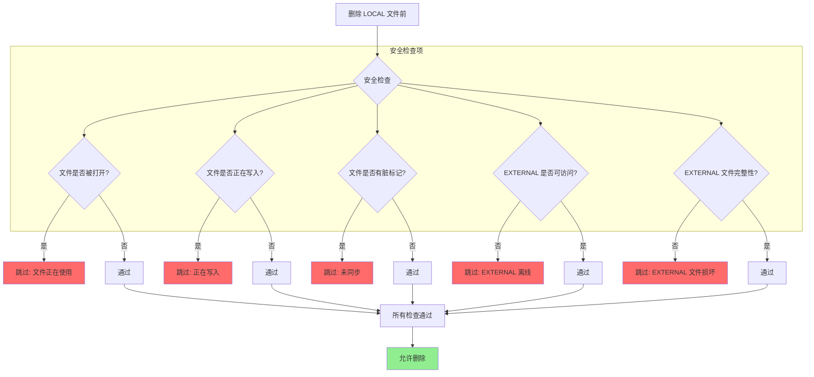
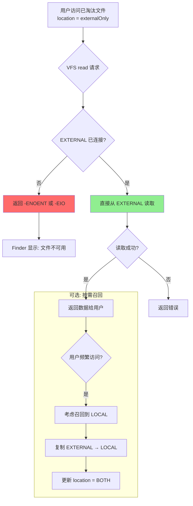
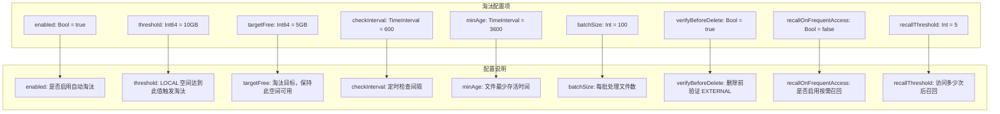
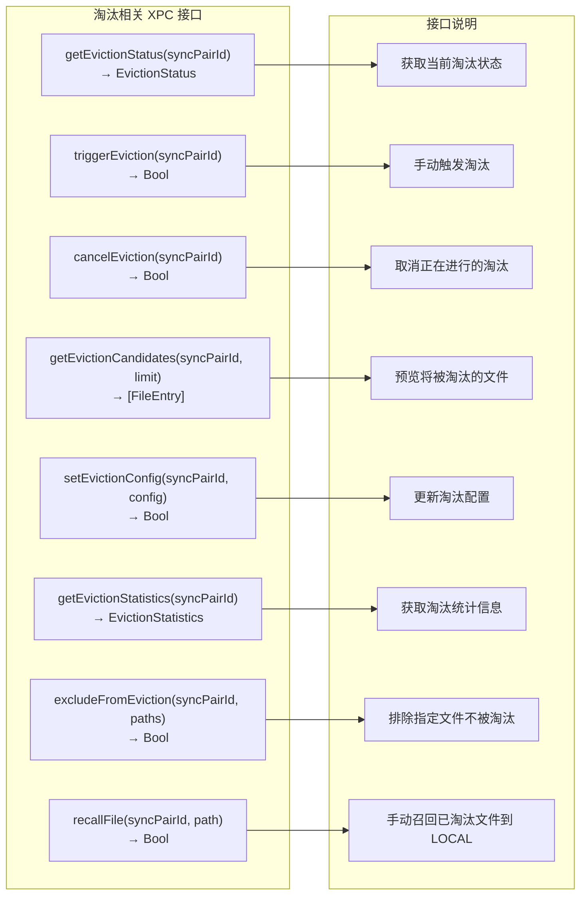

# 十一、热数据淘汰流程

> 返回 [目录](00_README.md) | 上一节: [10_冲突处理流程](10_冲突处理流程.md)

---

## 11.1 淘汰机制概述

## 11.2 淘汰触发条件

## 11.3 淘汰候选文件筛选

## 11.4 淘汰主流程

## 11.5 淘汰安全检查

## 11.6 淘汰后文件访问

## 11.7 淘汰配置

## 11.8 淘汰 XPC 接口

---

> 下一节: [12_完整启动时序](12_完整启动时序.md)
