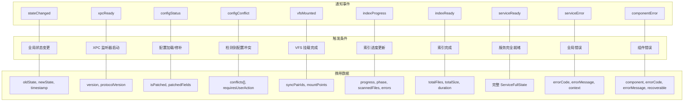

# 十四、分布式通知

> 返回 [目录](00_README.md) | 上一节: [13_App端交互流程](13_App端交互流程.md)

---

## 通知类型详情

| 通知类型 | 触发条件 | 携带数据 |
|----------|----------|----------|
| stateChanged | 全局状态变更 | oldState, newState, timestamp |
| xpcReady | XPC 监听器启动 | version, protocolVersion |
| configStatus | 配置加载/修补 | isPatched, patchedFields |
| configConflict | 检测到配置冲突 | conflicts[], requiresUserAction |
| vfsMounted | VFS 挂载完成 | syncPairIds, mountPoints |
| indexProgress | 索引进度更新 | progress, phase, scannedFiles, errors |
| indexReady | 索引完成 | totalFiles, totalSize, duration |
| serviceReady | 服务完全就绪 | 完整 ServiceFullState |
| serviceError | 全局错误 | errorCode, errorMessage, context |
| componentError | 组件错误 | component, errorCode, errorMessage, recoverable |

---

> 下一节: [15_错误处理](15_错误处理.md)
