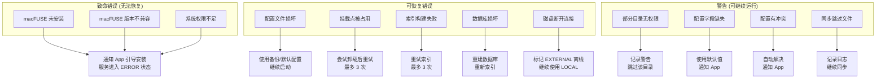
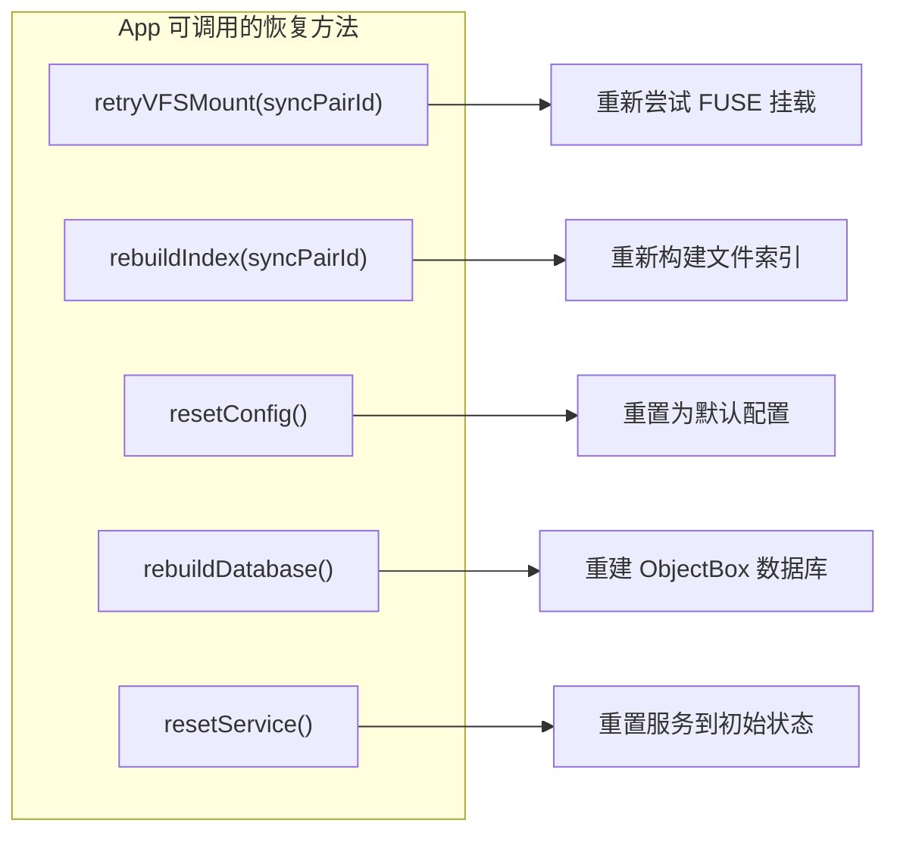

# 十五、错误处理

> 返回 [目录](00_README.md) | 上一节: [14_分布式通知](14_分布式通知.md)

---

## 15.1 错误分类与处理

## 15.2 错误恢复接口

## 15.3 错误码汇总

| 错误码 | 名称 | 说明 | 可恢复 |
|--------|------|------|--------|
| 1001 | E_XPC_LISTEN_FAILED | XPC 监听器启动失败 | 否 |
| 1002 | E_XPC_CONNECTION_INVALID | XPC 连接验证失败 | 是 |
| 1003 | E_XPC_TIMEOUT | XPC 调用超时 | 是 |
| 2001 | E_CONFIG_NOT_FOUND | 配置文件不存在 | 是 |
| 2002 | E_CONFIG_PARSE_FAILED | JSON 解析失败 | 是 |
| 2003 | E_CONFIG_INVALID | 配置验证失败 | 是 |
| 2004 | E_CONFIG_CONFLICT | 配置冲突 | 是 |
| 3001 | E_VFS_FUSE_NOT_INSTALLED | macFUSE 未安装 | 否 |
| 3002 | E_VFS_FUSE_VERSION | macFUSE 版本过低 | 否 |
| 3003 | E_VFS_MOUNT_FAILED | 挂载失败 | 是 |
| 3004 | E_VFS_PERMISSION | 权限不足 | 否 |
| 3005 | E_VFS_MOUNT_BUSY | 挂载点被占用 | 是 |
| 4001 | E_INDEX_SCAN_FAILED | 目录扫描失败 | 是 |
| 4002 | E_INDEX_PERMISSION | 目录访问权限不足 | 否 |
| 4003 | E_INDEX_SAVE_FAILED | 索引保存失败 | 是 |
| 5001 | E_SYNC_SOURCE_UNAVAILABLE | 源目录不可访问 | 是 |
| 5002 | E_SYNC_TARGET_READONLY | 目标只读 | 是 |
| 5003 | E_SYNC_CONFLICT | 文件冲突 | 是 |
| 5004 | E_SYNC_DISK_FULL | 磁盘空间不足 | 是 |
| 6001 | E_DB_OPEN_FAILED | 数据库打开失败 | 是 |
| 6002 | E_DB_CORRUPTED | 数据库损坏 | 是 |
| 6003 | E_DB_WRITE_FAILED | 写入失败 | 是 |

---

> 下一节: [16_日志规范](16_日志规范.md)
