# 十六、日志规范

> 返回 [目录](00_README.md) | 上一节: [15_错误处理](15_错误处理.md)

---

## 16.1 日志格式

```
[时间戳] [级别] [全局状态] [组件] [组件状态] 消息
```

## 16.2 启动日志时序

```mermaid
gantt
    title 服务启动日志时序
    dateFormat X
    axisFormat %L ms

    section 环境初始化
    设置环境变量     :0, 10
    加载 macFUSE    :10, 20
    初始化日志      :20, 30
    创建目录        :30, 50

    section XPC 启动
    创建 Service    :50, 80
    启动 XPC 监听   :80, 100

    section 配置加载
    加载配置文件    :100, 120
    验证配置        :120, 140
    解决冲突        :140, 150

    section VFS 挂载
    挂载 FUSE       :150, 250
    保护后端目录    :250, 300

    section 索引构建
    扫描 LOCAL      :300, 600
    扫描 EXTERNAL   :600, 1500
    合并保存        :1500, 1700

    section 完全就绪
    启动调度器      :1700, 1800
    发送缓存通知    :1800, 1850
```



## 16.3 日志示例

```
[10:00:00.000] [INFO ] [STARTING   ] [Main  ] [--     ] DMSAService v4.9 启动
[10:00:00.010] [INFO ] [STARTING   ] [Main  ] [--     ] 环境变量设置完成
[10:00:00.020] [INFO ] [STARTING   ] [Main  ] [--     ] macFUSE Framework 加载成功
[10:00:00.050] [INFO ] [STARTING   ] [Main  ] [--     ] 目录创建完成
[10:00:00.080] [INFO ] [STARTING   ] [XPC   ] [starting] ServiceImplementation 初始化完成
[10:00:00.100] [INFO ] [XPC_READY  ] [XPC   ] [ready  ] 监听器已启动，等待连接
[10:00:00.110] [INFO ] [XPC_READY  ] [Config] [starting] 开始加载配置
[10:00:00.120] [WARN ] [XPC_READY  ] [Config] [ready  ] 配置字段 'eviction.threshold' 缺失，使用默认值 10GB
[10:00:00.130] [INFO ] [XPC_READY  ] [Config] [ready  ] 配置加载完成，2 个 syncPairs
[10:00:00.150] [INFO ] [VFS_MOUNT  ] [VFS   ] [starting] 开始挂载 Downloads
[10:00:00.200] [INFO ] [VFS_BLOCKED] [VFS   ] [ready  ] FUSE 挂载完成，等待索引
[10:00:00.210] [INFO ] [VFS_BLOCKED] [VFS   ] [ready  ] 后端目录保护完成
[10:00:00.250] [INFO ] [INDEXING   ] [Index ] [busy   ] 开始扫描 LOCAL_DIR
[10:00:00.500] [INFO ] [INDEXING   ] [Index ] [busy   ] LOCAL_DIR: 1000 文件, 2.5GB
[10:00:00.600] [INFO ] [INDEXING   ] [Index ] [busy   ] 开始扫描 EXTERNAL_DIR
[10:00:01.500] [INFO ] [INDEXING   ] [Index ] [busy   ] EXTERNAL_DIR: 5000 文件, 50GB
[10:00:01.700] [INFO ] [INDEXING   ] [Index ] [ready  ] 索引合并完成: 5500 唯一文件
[10:00:01.750] [INFO ] [READY      ] [VFS   ] [ready  ] 索引就绪，解除访问阻塞
[10:00:01.800] [INFO ] [RUNNING    ] [Sync  ] [ready  ] 同步调度器已启动
[10:00:01.810] [INFO ] [RUNNING    ] [Evict ] [ready  ] 淘汰检查器已启动
[10:00:01.820] [INFO ] [RUNNING    ] [Main  ] [--     ] 服务完全就绪，发送 3 条缓存通知
```

## 16.4 日志级别说明

| 级别 | 用途 | 示例 |
|------|------|------|
| DEBUG | 调试信息 | 函数参数、中间变量 |
| INFO | 正常流程 | 启动完成、操作成功 |
| WARN | 警告信息 | 配置缺失、使用默认值 |
| ERROR | 错误信息 | 操作失败、需要关注 |
| FATAL | 致命错误 | 无法恢复、服务退出 |

---

> 下一节: [17_检查清单](17_检查清单.md)
