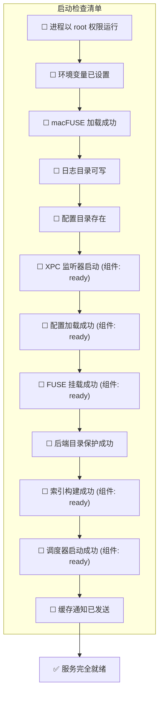

# 十七、检查清单

> 返回 [目录](00_README.md) | 上一节: [16_日志规范](16_日志规范.md)

---

## 检查项详情

| 检查项 | 验证方法 | 失败处理 |
|--------|----------|----------|
| 进程以 root 权限运行 | `getuid() == 0` | 退出，记录错误 |
| 环境变量已设置 | 检查 `OBJC_DISABLE_INITIALIZE_FORK_SAFETY` | 自动设置 |
| macFUSE 加载成功 | `dlopen("libfuse.dylib")` | 通知 App 引导安装 |
| 日志目录可写 | 创建测试文件 | 尝试创建目录 |
| 配置目录存在 | `FileManager.fileExists` | 创建目录 |
| XPC 监听器启动 | 组件状态 = ready | 记录错误，进入 ERROR 状态 |
| 配置加载成功 | 组件状态 = ready | 使用默认配置 |
| FUSE 挂载成功 | 组件状态 = ready | 重试 3 次 |
| 后端目录保护成功 | chmod + ACL 成功 | 记录警告，继续 |
| 索引构建成功 | 组件状态 = ready | 重试 3 次 |
| 调度器启动成功 | 组件状态 = ready | 记录错误 |
| 缓存通知已发送 | 队列为空 | 记录日志 |

---

*文档版本: 4.9 | 最后更新: 2026-01-27*
