# DMSA.app 启动与交互流程

> 版本: 1.0 | 更新日期: 2026-01-27
>
> 返回 [目录](00_README.md)

---

## 目录

1. [架构概述](#一架构概述)
2. [App 生命周期](#二app-生命周期)
3. [启动流程详解](#三启动流程详解)
4. [首次启动流程](#四首次启动流程)
5. [XPC 连接管理](#五xpc-连接管理)
6. [状态同步机制](#六状态同步机制)
7. [UI 状态机](#七ui-状态机)
8. [用户交互流程](#八用户交互流程)
9. [配置管理交互](#九配置管理交互)
10. [磁盘管理交互](#十磁盘管理交互)
11. [同步操作交互](#十一同步操作交互)
12. [错误处理与恢复](#十二错误处理与恢复)
13. [通知处理流程](#十三通知处理流程)
14. [后台与前台切换](#十四后台与前台切换)
15. [退出流程](#十五退出流程)

---

## 一、架构概述

### 1.1 App 架构分层

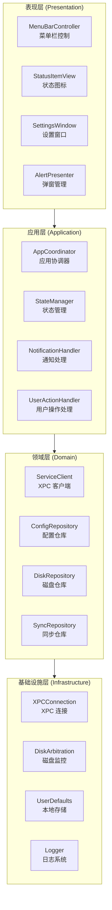
```mermaid
flowchart TB
    subgraph PresentationLayer["表现层 (Presentation)"]
        UI1["MenuBarController<br/>菜单栏控制"]
        UI2["StatusItemView<br/>状态图标"]
        UI3["SettingsWindow<br/>设置窗口"]
        UI4["AlertPresenter<br/>弹窗管理"]
    end

    subgraph ApplicationLayer["应用层 (Application)"]
        AL1["AppCoordinator<br/>应用协调器"]
        AL2["StateManager<br/>状态管理"]
        AL3["NotificationHandler<br/>通知处理"]
        AL4["UserActionHandler<br/>用户操作处理"]
    end

    subgraph DomainLayer["领域层 (Domain)"]
        DL1["ServiceClient<br/>XPC 客户端"]
        DL2["ConfigRepository<br/>配置仓库"]
        DL3["DiskRepository<br/>磁盘仓库"]
        DL4["SyncRepository<br/>同步仓库"]
    end

    subgraph InfrastructureLayer["基础设施层 (Infrastructure)"]
        IL1["XPCConnection<br/>XPC 连接"]
        IL2["DiskArbitration<br/>磁盘监控"]
        IL3["UserDefaults<br/>本地存储"]
        IL4["Logger<br/>日志系统"]
    end

    PresentationLayer --> ApplicationLayer
    ApplicationLayer --> DomainLayer
    DomainLayer --> InfrastructureLayer
```

### 1.2 核心组件职责

| 组件 | 职责 | 依赖 |
|------|------|------|
| **AppDelegate** | 应用生命周期、启动入口 | AppCoordinator |
| **AppCoordinator** | 协调各模块初始化和交互 | 所有 Manager |
| **ServiceClient** | XPC 通信封装 | XPCConnection |
| **StateManager** | App 内状态管理 | ServiceClient |
| **MenuBarController** | 菜单栏 UI 管理 | StateManager |
| **NotificationHandler** | 处理 Service 通知 | StateManager |

### 1.3 数据流向

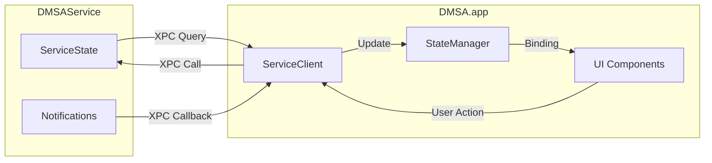
```mermaid
flowchart LR
    subgraph Service["DMSAService"]
        S1["ServiceState"]
        S2["Notifications"]
    end

    subgraph App["DMSA.app"]
        A1["ServiceClient"]
        A2["StateManager"]
        A3["UI Components"]
    end

    S1 -->|XPC Query| A1
    S2 -->|XPC Callback| A1
    A1 -->|Update| A2
    A2 -->|Binding| A3
    A3 -->|User Action| A1
    A1 -->|XPC Call| S1
```

---

## 二、App 生命周期

### 2.1 生命周期状态

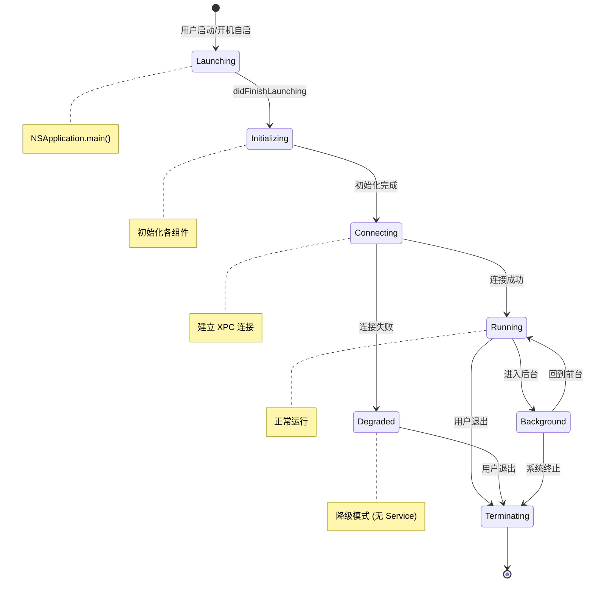
```mermaid
stateDiagram-v2
    [*] --> Launching: 用户启动/开机自启

    Launching --> Initializing: didFinishLaunching
    Initializing --> Connecting: 初始化完成
    Connecting --> Running: 连接成功
    Connecting --> Degraded: 连接失败

    Running --> Background: 进入后台
    Background --> Running: 回到前台

    Running --> Terminating: 用户退出
    Degraded --> Terminating: 用户退出
    Background --> Terminating: 系统终止

    Terminating --> [*]

    note right of Launching: NSApplication.main()
    note right of Initializing: 初始化各组件
    note right of Connecting: 建立 XPC 连接
    note right of Running: 正常运行
    note right of Degraded: 降级模式 (无 Service)
```

### 2.2 生命周期回调

```swift
// AppDelegate 生命周期回调
protocol AppLifecycle {
    // 启动完成
    func applicationDidFinishLaunching(_ notification: Notification)

    // 即将终止
    func applicationWillTerminate(_ notification: Notification)

    // 进入后台
    func applicationDidResignActive(_ notification: Notification)

    // 回到前台
    func applicationDidBecomeActive(_ notification: Notification)

    // 收到重新打开请求 (点击 Dock 图标)
    func applicationShouldHandleReopen(_ sender: NSApplication, hasVisibleWindows: Bool) -> Bool
}
```

---

## 三、启动流程详解

### 3.1 启动阶段总览

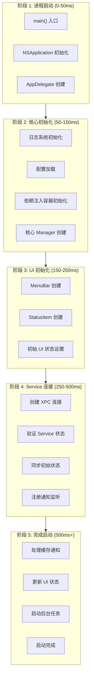
```mermaid
flowchart TD
    subgraph Phase1["阶段 1: 进程启动 (0-50ms)"]
        P1A["main() 入口"]
        P1B["NSApplication 初始化"]
        P1C["AppDelegate 创建"]
    end

    subgraph Phase2["阶段 2: 核心初始化 (50-150ms)"]
        P2A["日志系统初始化"]
        P2B["配置加载"]
        P2C["依赖注入容器初始化"]
        P2D["核心 Manager 创建"]
    end

    subgraph Phase3["阶段 3: UI 初始化 (150-250ms)"]
        P3A["MenuBar 创建"]
        P3B["StatusItem 创建"]
        P3C["初始 UI 状态设置"]
    end

    subgraph Phase4["阶段 4: Service 连接 (250-500ms)"]
        P4A["创建 XPC 连接"]
        P4B["验证 Service 状态"]
        P4C["同步初始状态"]
        P4D["注册通知监听"]
    end

    subgraph Phase5["阶段 5: 完成启动 (500ms+)"]
        P5A["处理缓存通知"]
        P5B["更新 UI 状态"]
        P5C["启动后台任务"]
        P5D["启动完成"]
    end

    Phase1 --> Phase2 --> Phase3 --> Phase4 --> Phase5
```

### 3.2 详细启动时序

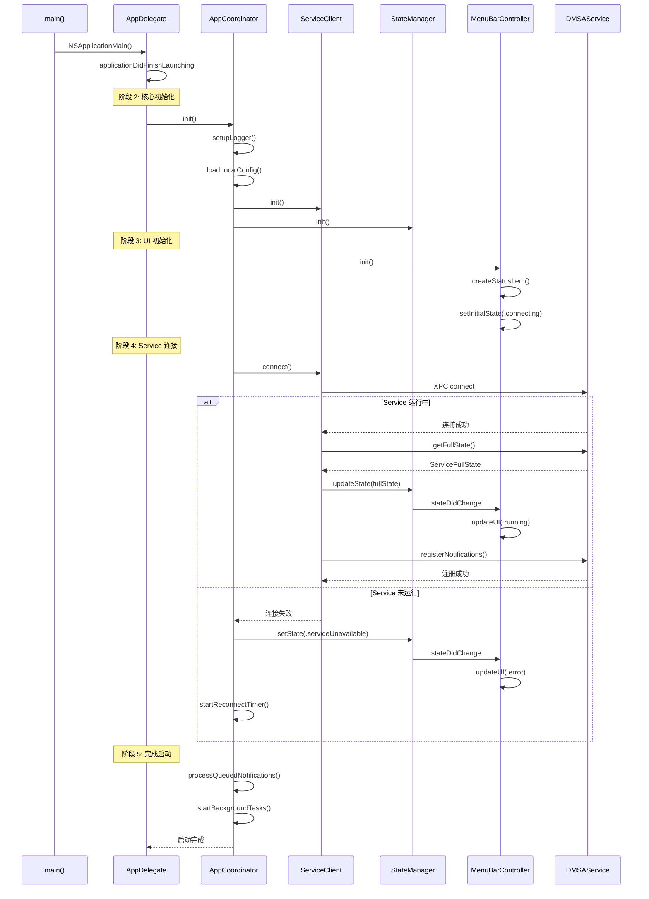
```mermaid
sequenceDiagram
    participant Main as main()
    participant AD as AppDelegate
    participant AC as AppCoordinator
    participant SC as ServiceClient
    participant SM as StateManager
    participant MB as MenuBarController
    participant Service as DMSAService

    Main->>AD: NSApplicationMain()
    AD->>AD: applicationDidFinishLaunching

    Note over AD: 阶段 2: 核心初始化
    AD->>AC: init()
    AC->>AC: setupLogger()
    AC->>AC: loadLocalConfig()
    AC->>SC: init()
    AC->>SM: init()

    Note over AD: 阶段 3: UI 初始化
    AC->>MB: init()
    MB->>MB: createStatusItem()
    MB->>MB: setInitialState(.connecting)

    Note over AD: 阶段 4: Service 连接
    AC->>SC: connect()
    SC->>Service: XPC connect

    alt Service 运行中
        Service-->>SC: 连接成功
        SC->>Service: getFullState()
        Service-->>SC: ServiceFullState
        SC->>SM: updateState(fullState)
        SM->>MB: stateDidChange
        MB->>MB: updateUI(.running)

        SC->>Service: registerNotifications()
        Service-->>SC: 注册成功
    else Service 未运行
        SC-->>AC: 连接失败
        AC->>SM: setState(.serviceUnavailable)
        SM->>MB: stateDidChange
        MB->>MB: updateUI(.error)
        AC->>AC: startReconnectTimer()
    end

    Note over AD: 阶段 5: 完成启动
    AC->>AC: processQueuedNotifications()
    AC->>AC: startBackgroundTasks()
    AC-->>AD: 启动完成
```

### 3.3 启动流程代码结构

```swift
// AppDelegate.swift
@main
class AppDelegate: NSObject, NSApplicationDelegate {
    private var coordinator: AppCoordinator!

    func applicationDidFinishLaunching(_ notification: Notification) {
        // 阶段 2: 核心初始化
        coordinator = AppCoordinator()
        coordinator.initialize()

        // 阶段 3-5 由 coordinator 异步处理
        coordinator.start { result in
            switch result {
            case .success:
                Logger.info("App 启动完成")
            case .failure(let error):
                Logger.error("App 启动失败: \(error)")
                self.handleStartupFailure(error)
            }
        }
    }
}

// AppCoordinator.swift
class AppCoordinator {
    private let serviceClient: ServiceClient
    private let stateManager: StateManager
    private let menuBarController: MenuBarController
    private let notificationHandler: NotificationHandler

    func initialize() {
        // 1. 日志系统
        Logger.setup(level: .info)

        // 2. 核心组件
        serviceClient = ServiceClient()
        stateManager = StateManager()
        notificationHandler = NotificationHandler(stateManager: stateManager)

        // 3. UI 组件
        menuBarController = MenuBarController(stateManager: stateManager)

        // 4. 绑定
        stateManager.delegate = menuBarController
        serviceClient.notificationDelegate = notificationHandler
    }

    func start(completion: @escaping (Result<Void, Error>) -> Void) {
        // 异步连接 Service
        serviceClient.connect { [weak self] result in
            switch result {
            case .success:
                self?.syncInitialState(completion: completion)
            case .failure(let error):
                self?.handleConnectionFailure(error)
                completion(.failure(error))
            }
        }
    }
}
```

---

## 四、首次启动流程

### 4.1 首次启动检测

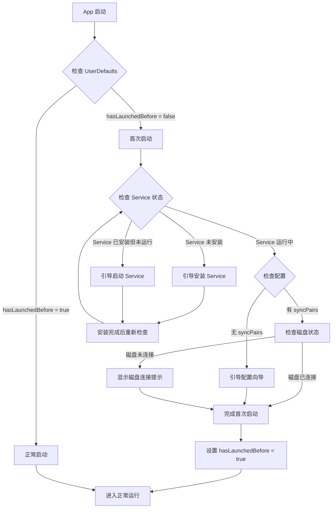
```mermaid
flowchart TD
    A[App 启动] --> B{检查 UserDefaults}

    B -->|hasLaunchedBefore = false| C[首次启动]
    B -->|hasLaunchedBefore = true| D[正常启动]

    C --> E{检查 Service 状态}

    E -->|Service 未安装| F[引导安装 Service]
    E -->|Service 已安装但未运行| G[引导启动 Service]
    E -->|Service 运行中| H{检查配置}

    H -->|无 syncPairs| I[引导配置向导]
    H -->|有 syncPairs| J[检查磁盘状态]

    J -->|磁盘未连接| K[显示磁盘连接提示]
    J -->|磁盘已连接| L[完成首次启动]

    F --> M[安装完成后重新检查]
    G --> M
    I --> L
    K --> L
    M --> E

    L --> N["设置 hasLaunchedBefore = true"]
    N --> O[进入正常运行]

    D --> O
```

### 4.2 首次启动向导

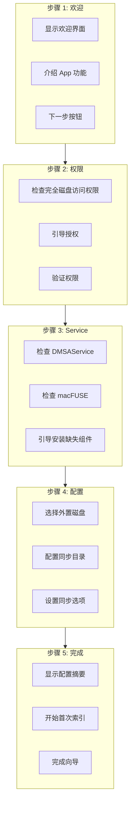
```mermaid
flowchart TD
    subgraph WelcomeStep["步骤 1: 欢迎"]
        W1["显示欢迎界面"]
        W2["介绍 App 功能"]
        W3["下一步按钮"]
    end

    subgraph PermissionStep["步骤 2: 权限"]
        P1["检查完全磁盘访问权限"]
        P2["引导授权"]
        P3["验证权限"]
    end

    subgraph ServiceStep["步骤 3: Service"]
        S1["检查 DMSAService"]
        S2["检查 macFUSE"]
        S3["引导安装缺失组件"]
    end

    subgraph ConfigStep["步骤 4: 配置"]
        C1["选择外置磁盘"]
        C2["配置同步目录"]
        C3["设置同步选项"]
    end

    subgraph CompleteStep["步骤 5: 完成"]
        F1["显示配置摘要"]
        F2["开始首次索引"]
        F3["完成向导"]
    end

    WelcomeStep --> PermissionStep --> ServiceStep --> ConfigStep --> CompleteStep
```

### 4.3 首次启动状态结构

```swift
struct FirstLaunchState {
    var currentStep: FirstLaunchStep
    var completedSteps: Set<FirstLaunchStep>
    var errors: [FirstLaunchStep: Error]

    enum FirstLaunchStep: Int, CaseIterable {
        case welcome = 0
        case permissions = 1
        case serviceCheck = 2
        case configuration = 3
        case complete = 4
    }

    var canProceed: Bool {
        switch currentStep {
        case .welcome:
            return true
        case .permissions:
            return hasFullDiskAccess
        case .serviceCheck:
            return isServiceRunning && isMacFUSEInstalled
        case .configuration:
            return hasValidConfiguration
        case .complete:
            return true
        }
    }
}
```

---

## 五、XPC 连接管理

### 5.1 连接状态机

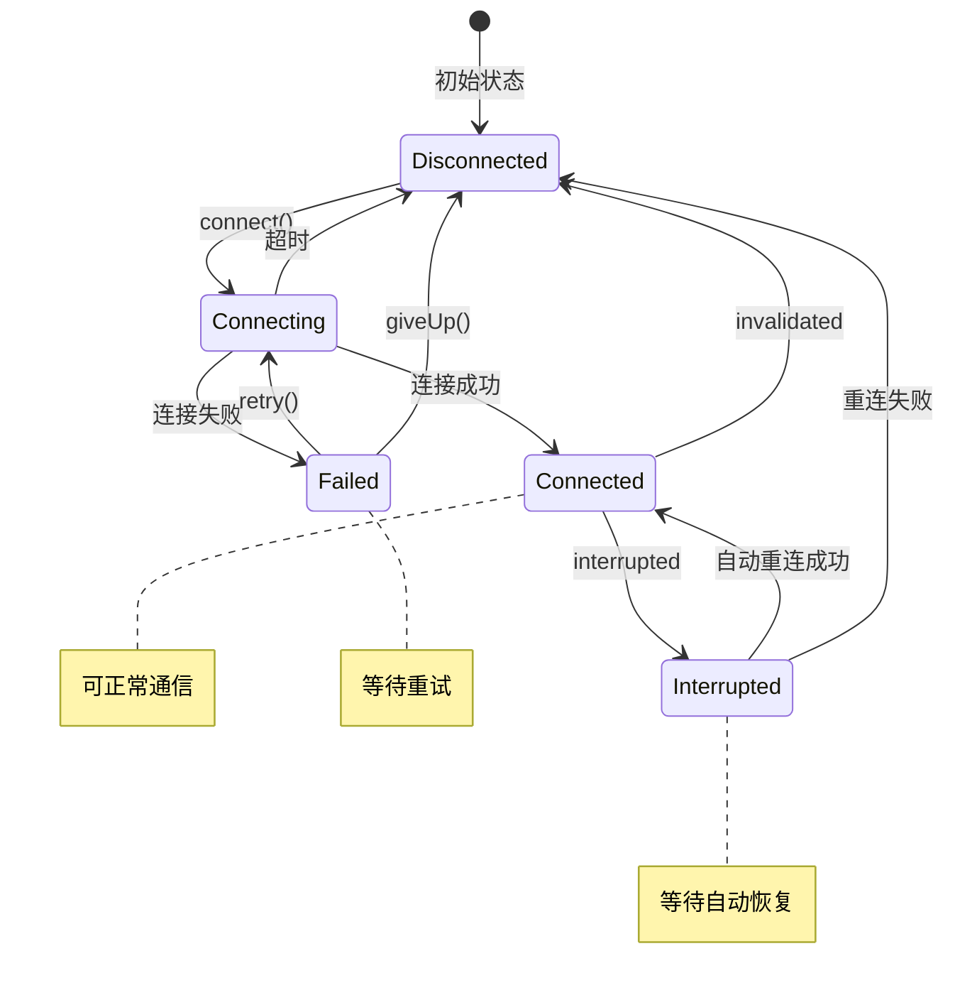
```mermaid
stateDiagram-v2
    [*] --> Disconnected: 初始状态

    Disconnected --> Connecting: connect()
    Connecting --> Connected: 连接成功
    Connecting --> Failed: 连接失败
    Connecting --> Disconnected: 超时

    Connected --> Disconnected: invalidated
    Connected --> Interrupted: interrupted

    Interrupted --> Connected: 自动重连成功
    Interrupted --> Disconnected: 重连失败

    Failed --> Connecting: retry()
    Failed --> Disconnected: giveUp()

    note right of Connected: 可正常通信
    note right of Interrupted: 等待自动恢复
    note right of Failed: 等待重试
```

### 5.2 连接管理流程

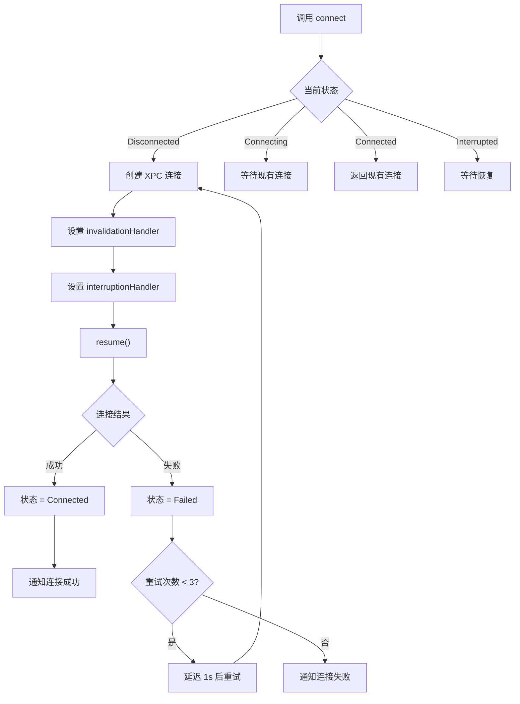
```mermaid
flowchart TD
    A[调用 connect] --> B{当前状态}

    B -->|Disconnected| C[创建 XPC 连接]
    B -->|Connecting| D[等待现有连接]
    B -->|Connected| E[返回现有连接]
    B -->|Interrupted| F[等待恢复]

    C --> G["设置 invalidationHandler"]
    G --> H["设置 interruptionHandler"]
    H --> I["resume()"]

    I --> J{连接结果}
    J -->|成功| K[状态 = Connected]
    J -->|失败| L[状态 = Failed]

    K --> M[通知连接成功]
    L --> N{重试次数 < 3?}
    N -->|是| O["延迟 1s 后重试"]
    N -->|否| P[通知连接失败]

    O --> C
```

### 5.3 连接恢复机制

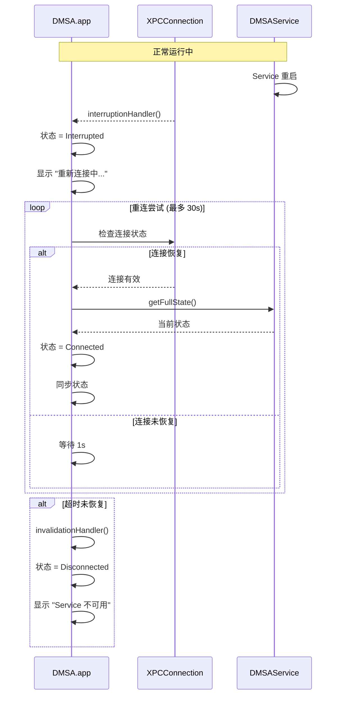
```mermaid
sequenceDiagram
    participant App as DMSA.app
    participant XPC as XPCConnection
    participant Service as DMSAService

    Note over App,Service: 正常运行中

    Service->>Service: Service 重启
    XPC-->>App: interruptionHandler()

    App->>App: 状态 = Interrupted
    App->>App: 显示 "重新连接中..."

    loop 重连尝试 (最多 30s)
        App->>XPC: 检查连接状态
        alt 连接恢复
            XPC-->>App: 连接有效
            App->>Service: getFullState()
            Service-->>App: 当前状态
            App->>App: 状态 = Connected
            App->>App: 同步状态
        else 连接未恢复
            App->>App: 等待 1s
        end
    end

    alt 超时未恢复
        App->>App: invalidationHandler()
        App->>App: 状态 = Disconnected
        App->>App: 显示 "Service 不可用"
    end
```

### 5.4 XPC 连接代码结构

```swift
actor XPCConnectionManager {
    private var connection: NSXPCConnection?
    private var state: ConnectionState = .disconnected
    private var retryCount = 0
    private let maxRetries = 3

    enum ConnectionState {
        case disconnected
        case connecting
        case connected
        case interrupted
        case failed(Error)
    }

    func connect() async throws -> DMSAServiceProtocol {
        switch state {
        case .connected:
            guard let proxy = connection?.remoteObjectProxy as? DMSAServiceProtocol else {
                throw ConnectionError.invalidProxy
            }
            return proxy

        case .connecting:
            // 等待现有连接完成
            return try await waitForConnection()

        case .disconnected, .failed, .interrupted:
            return try await establishConnection()
        }
    }

    private func establishConnection() async throws -> DMSAServiceProtocol {
        state = .connecting

        let conn = NSXPCConnection(machServiceName: "com.ttttt.dmsa.service")
        conn.remoteObjectInterface = NSXPCInterface(with: DMSAServiceProtocol.self)

        conn.invalidationHandler = { [weak self] in
            Task { await self?.handleInvalidation() }
        }

        conn.interruptionHandler = { [weak self] in
            Task { await self?.handleInterruption() }
        }

        conn.resume()

        // 验证连接
        guard let proxy = conn.remoteObjectProxy as? DMSAServiceProtocol else {
            throw ConnectionError.invalidProxy
        }

        // 测试连接
        try await withCheckedThrowingContinuation { continuation in
            proxy.healthCheck { error in
                if let error = error {
                    continuation.resume(throwing: error)
                } else {
                    continuation.resume()
                }
            }
        }

        connection = conn
        state = .connected
        retryCount = 0

        return proxy
    }
}
```

---

## 六、状态同步机制

### 6.1 状态同步流程

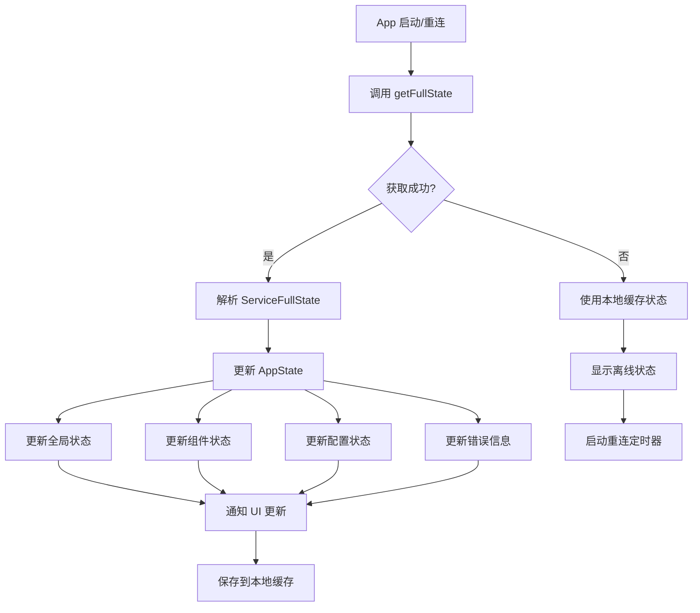
```mermaid
flowchart TD
    A[App 启动/重连] --> B[调用 getFullState]

    B --> C{获取成功?}
    C -->|否| D[使用本地缓存状态]
    C -->|是| E[解析 ServiceFullState]

    E --> F[更新 AppState]

    F --> F1[更新全局状态]
    F --> F2[更新组件状态]
    F --> F3[更新配置状态]
    F --> F4[更新错误信息]

    F1 & F2 & F3 & F4 --> G[通知 UI 更新]

    G --> H[保存到本地缓存]

    D --> I[显示离线状态]
    I --> J[启动重连定时器]
```

### 6.2 状态数据结构

```swift
// App 端状态管理
@MainActor
class AppStateManager: ObservableObject {
    // 连接状态
    @Published var connectionState: ConnectionState = .disconnected

    // Service 状态 (镜像)
    @Published var serviceState: ServiceState = .unknown
    @Published var componentStates: [String: ComponentState] = [:]

    // UI 状态
    @Published var uiState: UIState = .initializing

    // 配置状态
    @Published var syncPairs: [SyncPairConfig] = []
    @Published var disks: [DiskConfig] = []

    // 进度状态
    @Published var indexProgress: IndexProgress?
    @Published var syncProgress: SyncProgress?

    // 错误状态
    @Published var lastError: AppError?
    @Published var pendingConflicts: Int = 0

    // 统计信息
    @Published var statistics: AppStatistics?
}

struct AppStatistics {
    var totalFiles: Int
    var totalSize: Int64
    var localFiles: Int
    var localSize: Int64
    var dirtyFiles: Int
    var lastSyncTime: Date?
    var lastEvictionTime: Date?
}
```

### 6.3 状态更新流程

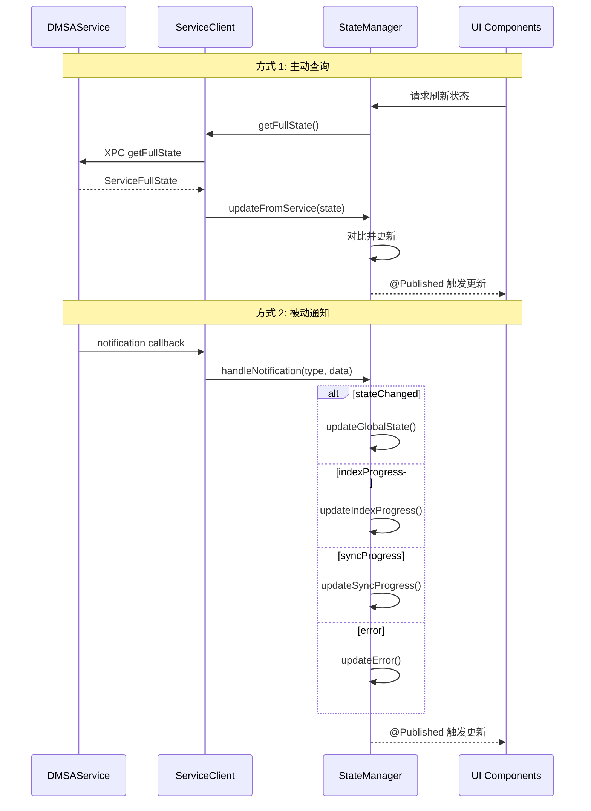
```mermaid
sequenceDiagram
    participant Service as DMSAService
    participant SC as ServiceClient
    participant SM as StateManager
    participant UI as UI Components

    Note over Service,UI: 方式 1: 主动查询

    UI->>SM: 请求刷新状态
    SM->>SC: getFullState()
    SC->>Service: XPC getFullState
    Service-->>SC: ServiceFullState
    SC->>SM: updateFromService(state)
    SM->>SM: 对比并更新
    SM-->>UI: @Published 触发更新

    Note over Service,UI: 方式 2: 被动通知

    Service->>SC: notification callback
    SC->>SM: handleNotification(type, data)

    alt stateChanged
        SM->>SM: updateGlobalState()
    else indexProgress
        SM->>SM: updateIndexProgress()
    else syncProgress
        SM->>SM: updateSyncProgress()
    else error
        SM->>SM: updateError()
    end

    SM-->>UI: @Published 触发更新
```

---

## 七、UI 状态机

### 7.1 UI 状态定义

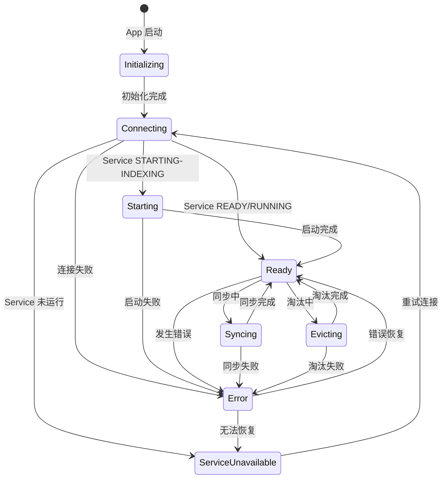
```mermaid
stateDiagram-v2
    [*] --> Initializing: App 启动

    Initializing --> Connecting: 初始化完成
    Connecting --> Ready: Service READY/RUNNING
    Connecting --> Starting: Service STARTING-INDEXING
    Connecting --> Error: 连接失败
    Connecting --> ServiceUnavailable: Service 未运行

    Starting --> Ready: 启动完成
    Starting --> Error: 启动失败

    Ready --> Syncing: 同步中
    Ready --> Evicting: 淘汰中
    Ready --> Error: 发生错误

    Syncing --> Ready: 同步完成
    Syncing --> Error: 同步失败

    Evicting --> Ready: 淘汰完成
    Evicting --> Error: 淘汰失败

    Error --> Ready: 错误恢复
    Error --> ServiceUnavailable: 无法恢复

    ServiceUnavailable --> Connecting: 重试连接
```

### 7.2 UI 状态与显示映射

```swift
enum UIState {
    case initializing           // 初始化中
    case connecting             // 连接中
    case starting(progress: Double, phase: String)  // 启动中
    case ready                  // 就绪
    case syncing(progress: SyncProgress)           // 同步中
    case evicting(progress: EvictionProgress)      // 淘汰中
    case error(AppError)        // 错误
    case serviceUnavailable     // Service 不可用

    var statusBarIcon: NSImage {
        switch self {
        case .initializing, .connecting:
            return .statusGray
        case .starting:
            return .statusYellowAnimated
        case .ready:
            return .statusGreen
        case .syncing, .evicting:
            return .statusBlueAnimated
        case .error, .serviceUnavailable:
            return .statusRed
        }
    }

    var statusText: String {
        switch self {
        case .initializing:
            return "初始化中..."
        case .connecting:
            return "连接服务..."
        case .starting(let progress, let phase):
            return "\(phase) \(Int(progress * 100))%"
        case .ready:
            return "运行中"
        case .syncing(let progress):
            return "同步中 \(Int(progress.progress * 100))%"
        case .evicting(let progress):
            return "清理中 \(Int(progress.progress * 100))%"
        case .error(let error):
            return "错误: \(error.localizedDescription)"
        case .serviceUnavailable:
            return "服务不可用"
        }
    }

    var menuEnabled: Bool {
        switch self {
        case .ready, .syncing, .evicting:
            return true
        default:
            return false
        }
    }
}
```

### 7.3 菜单栏状态更新

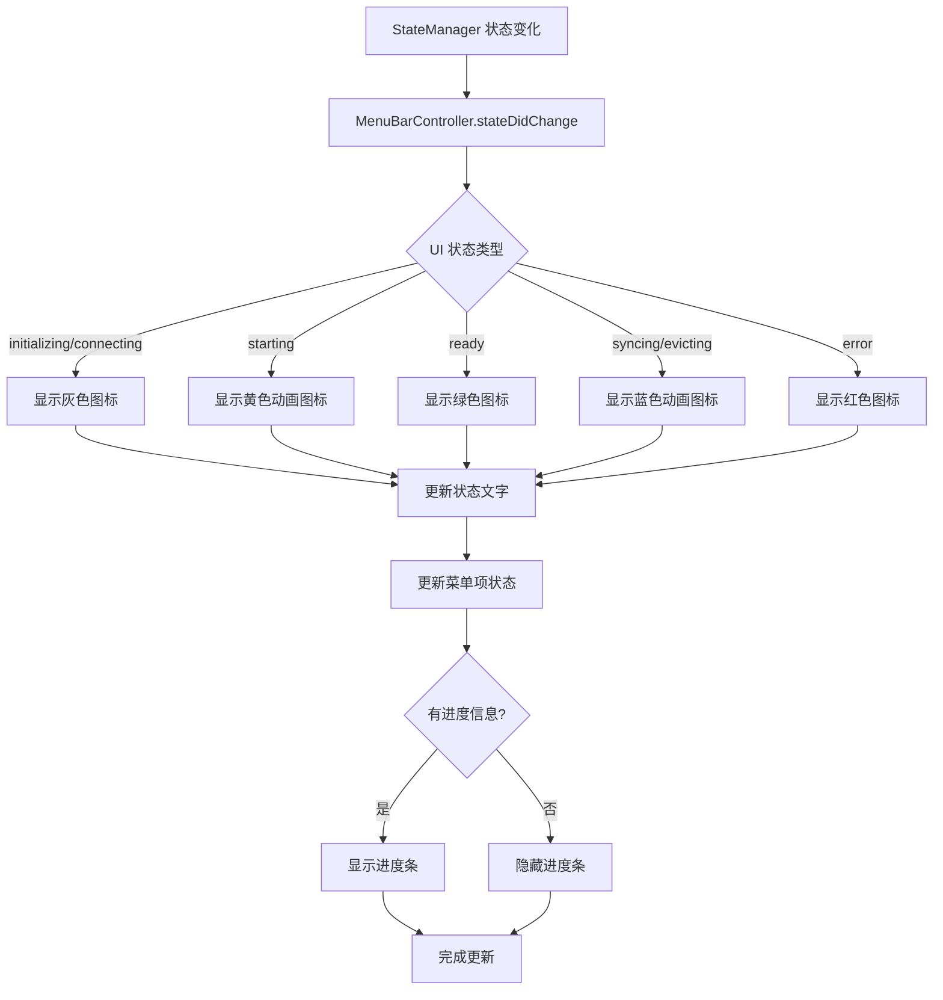
```mermaid
flowchart TD
    A[StateManager 状态变化] --> B[MenuBarController.stateDidChange]

    B --> C{UI 状态类型}

    C -->|initializing/connecting| D[显示灰色图标]
    C -->|starting| E[显示黄色动画图标]
    C -->|ready| F[显示绿色图标]
    C -->|syncing/evicting| G[显示蓝色动画图标]
    C -->|error| H[显示红色图标]

    D --> I[更新状态文字]
    E --> I
    F --> I
    G --> I
    H --> I

    I --> J[更新菜单项状态]
    J --> K{有进度信息?}
    K -->|是| L[显示进度条]
    K -->|否| M[隐藏进度条]

    L --> N[完成更新]
    M --> N
```

---

## 八、用户交互流程

### 8.1 菜单栏交互

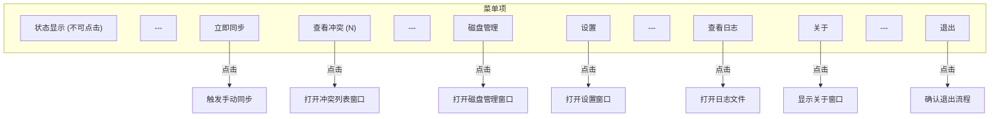
```mermaid
flowchart TD
    subgraph MenuItems["菜单项"]
        M1["状态显示 (不可点击)"]
        M2["---"]
        M3["立即同步"]
        M4["查看冲突 (N)"]
        M5["---"]
        M6["磁盘管理"]
        M7["设置"]
        M8["---"]
        M9["查看日志"]
        M10["关于"]
        M11["---"]
        M12["退出"]
    end

    M3 -->|点击| A1["触发手动同步"]
    M4 -->|点击| A2["打开冲突列表窗口"]
    M6 -->|点击| A3["打开磁盘管理窗口"]
    M7 -->|点击| A4["打开设置窗口"]
    M9 -->|点击| A5["打开日志文件"]
    M10 -->|点击| A6["显示关于窗口"]
    M12 -->|点击| A7["确认退出流程"]
```

### 8.2 立即同步交互

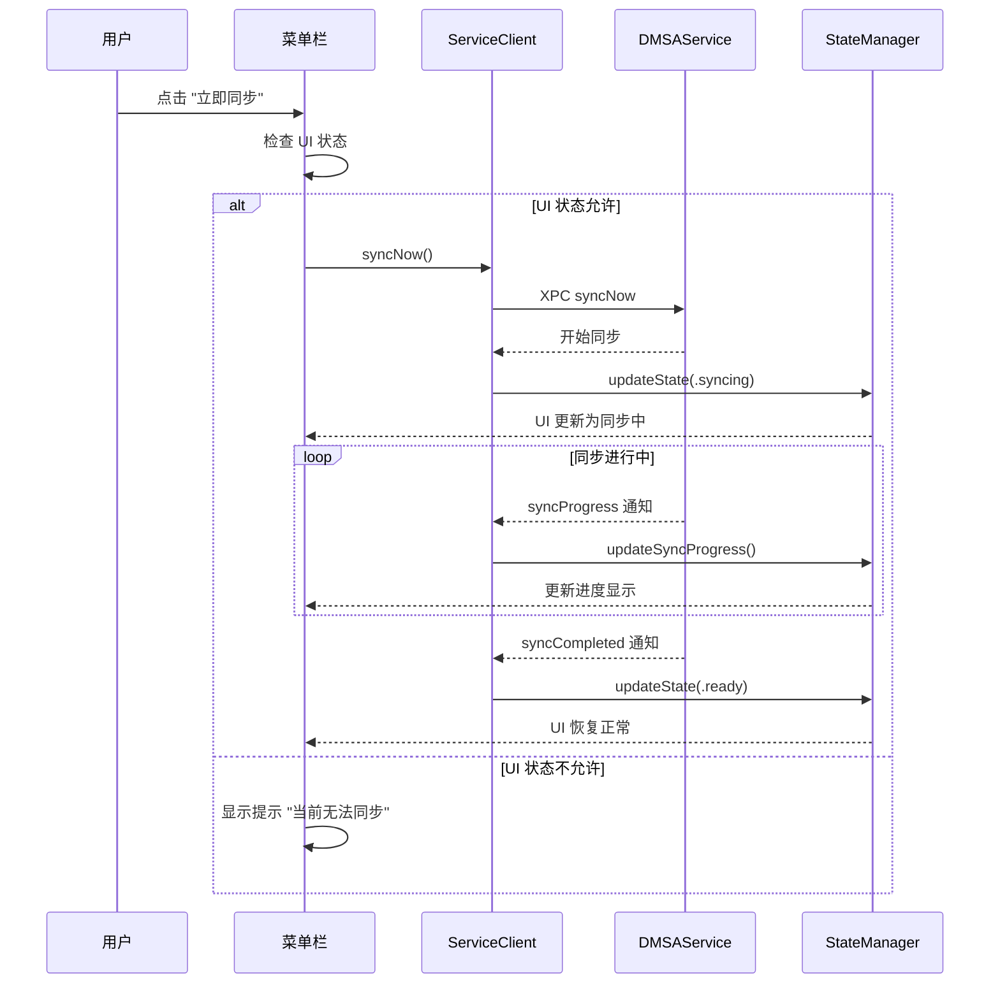
```mermaid
sequenceDiagram
    participant User as 用户
    participant Menu as 菜单栏
    participant SC as ServiceClient
    participant Service as DMSAService
    participant SM as StateManager

    User->>Menu: 点击 "立即同步"
    Menu->>Menu: 检查 UI 状态

    alt UI 状态允许
        Menu->>SC: syncNow()
        SC->>Service: XPC syncNow

        Service-->>SC: 开始同步
        SC->>SM: updateState(.syncing)
        SM-->>Menu: UI 更新为同步中

        loop 同步进行中
            Service-->>SC: syncProgress 通知
            SC->>SM: updateSyncProgress()
            SM-->>Menu: 更新进度显示
        end

        Service-->>SC: syncCompleted 通知
        SC->>SM: updateState(.ready)
        SM-->>Menu: UI 恢复正常

    else UI 状态不允许
        Menu->>Menu: 显示提示 "当前无法同步"
    end
```

### 8.3 查看冲突交互

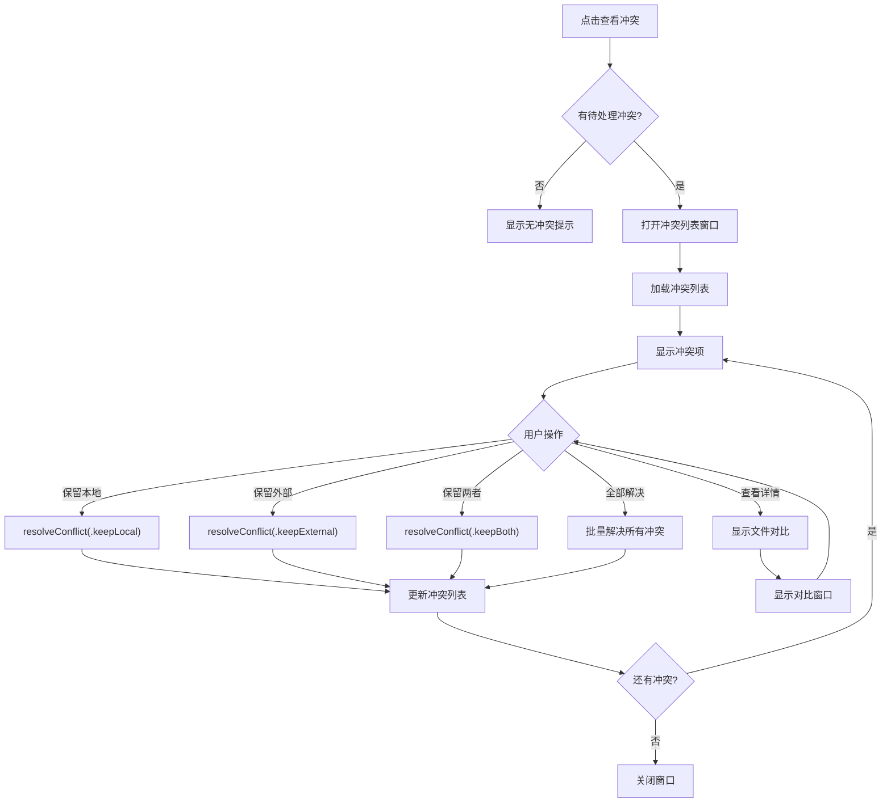
```mermaid
flowchart TD
    A[点击查看冲突] --> B{有待处理冲突?}

    B -->|否| C["显示无冲突提示"]
    B -->|是| D["打开冲突列表窗口"]

    D --> E[加载冲突列表]
    E --> F[显示冲突项]

    F --> G{用户操作}

    G -->|查看详情| H[显示文件对比]
    G -->|保留本地| I["resolveConflict(.keepLocal)"]
    G -->|保留外部| J["resolveConflict(.keepExternal)"]
    G -->|保留两者| K["resolveConflict(.keepBoth)"]
    G -->|全部解决| L[批量解决所有冲突]

    I --> M[更新冲突列表]
    J --> M
    K --> M
    L --> M

    H --> N[显示对比窗口]
    N --> G

    M --> O{还有冲突?}
    O -->|是| F
    O -->|否| P[关闭窗口]
```

---

## 九、配置管理交互

### 9.1 设置窗口结构

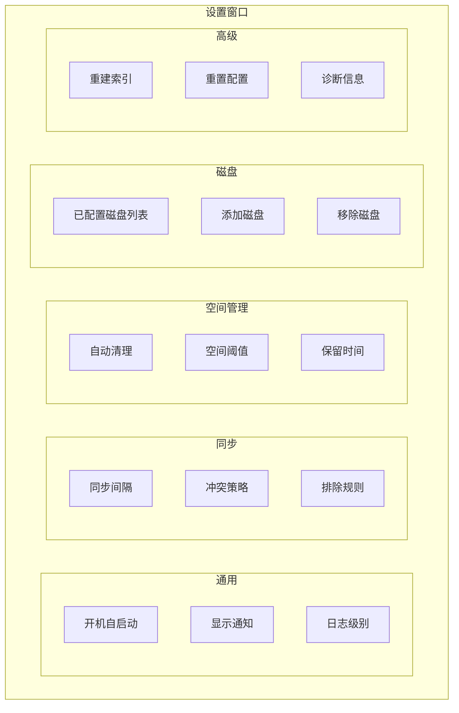
```mermaid
flowchart TB
    subgraph SettingsWindow["设置窗口"]
        subgraph GeneralTab["通用"]
            G1["开机自启动"]
            G2["显示通知"]
            G3["日志级别"]
        end

        subgraph SyncTab["同步"]
            S1["同步间隔"]
            S2["冲突策略"]
            S3["排除规则"]
        end

        subgraph EvictionTab["空间管理"]
            E1["自动清理"]
            E2["空间阈值"]
            E3["保留时间"]
        end

        subgraph DiskTab["磁盘"]
            D1["已配置磁盘列表"]
            D2["添加磁盘"]
            D3["移除磁盘"]
        end

        subgraph AdvancedTab["高级"]
            A1["重建索引"]
            A2["重置配置"]
            A3["诊断信息"]
        end
    end
```

### 9.2 配置修改流程

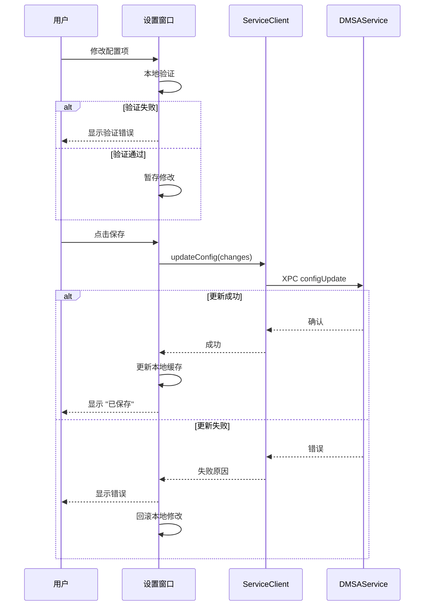
```mermaid
sequenceDiagram
    participant User as 用户
    participant UI as 设置窗口
    participant SC as ServiceClient
    participant Service as DMSAService

    User->>UI: 修改配置项
    UI->>UI: 本地验证

    alt 验证失败
        UI-->>User: 显示验证错误
    else 验证通过
        UI->>UI: 暂存修改
    end

    User->>UI: 点击保存
    UI->>SC: updateConfig(changes)
    SC->>Service: XPC configUpdate

    alt 更新成功
        Service-->>SC: 确认
        SC-->>UI: 成功
        UI->>UI: 更新本地缓存
        UI-->>User: 显示 "已保存"
    else 更新失败
        Service-->>SC: 错误
        SC-->>UI: 失败原因
        UI-->>User: 显示错误
        UI->>UI: 回滚本地修改
    end
```

### 9.3 配置验证规则

```swift
struct ConfigValidator {
    static func validate(_ config: AppConfig) -> [ValidationError] {
        var errors: [ValidationError] = []

        // 同步间隔验证
        if config.syncInterval < 60 {
            errors.append(.syncIntervalTooShort(minimum: 60))
        }

        // 空间阈值验证
        if config.evictionThreshold < 1_000_000_000 { // 1GB
            errors.append(.evictionThresholdTooLow(minimum: 1_000_000_000))
        }

        // 路径验证
        for syncPair in config.syncPairs {
            if syncPair.localDir == syncPair.targetDir {
                errors.append(.pathConflict(syncPair.id))
            }
        }

        return errors
    }
}
```

---

## 十、磁盘管理交互

### 10.1 磁盘状态监控

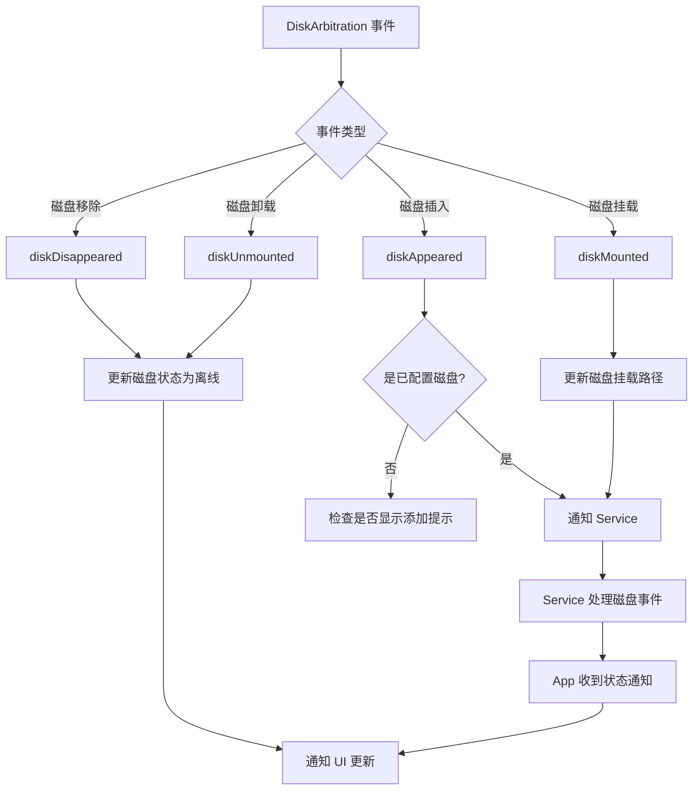
```mermaid
flowchart TD
    A[DiskArbitration 事件] --> B{事件类型}

    B -->|磁盘插入| C[diskAppeared]
    B -->|磁盘移除| D[diskDisappeared]
    B -->|磁盘挂载| E[diskMounted]
    B -->|磁盘卸载| F[diskUnmounted]

    C --> G{是已配置磁盘?}
    G -->|是| H[通知 Service]
    G -->|否| I[检查是否显示添加提示]

    D --> J[更新磁盘状态为离线]
    J --> K[通知 UI 更新]

    E --> L[更新磁盘挂载路径]
    L --> H

    F --> J

    H --> M[Service 处理磁盘事件]
    M --> N[App 收到状态通知]
    N --> K
```

### 10.2 添加磁盘流程

```mermaid
sequenceDiagram
    participant User as 用户
    participant UI as 磁盘管理窗口
    participant DA as DiskArbitration
    participant SC as ServiceClient
    participant Service as DMSAService

    User->>UI: 点击添加磁盘
    UI->>DA: 获取可用磁盘列表
    DA-->>UI: 外置磁盘列表

    UI->>UI: 过滤已配置磁盘
    UI-->>User: 显示可添加磁盘

    User->>UI: 选择磁盘
    UI-->>User: 显示配置选项

    Note over User,UI: 配置选项
    User->>UI: 输入名称
    User->>UI: 选择同步目录
    User->>UI: 选择目标目录 (默认 ~/Downloads)

    User->>UI: 点击确认
    UI->>UI: 验证配置

    UI->>SC: addDisk(config)
    SC->>Service: XPC addDisk

    alt 添加成功
        Service-->>SC: 确认
        Service->>Service: 创建 syncPair
        Service->>Service: 开始索引
        SC-->>UI: 成功
        UI-->>User: 显示 "磁盘已添加"
    else 添加失败
        Service-->>SC: 错误
        SC-->>UI: 失败原因
        UI-->>User: 显示错误
    end
```

### 10.3 磁盘状态显示

```swift
struct DiskStatusView {
    enum DiskStatus {
        case online(mountPath: String)
        case offline
        case syncing(progress: Double)
        case error(message: String)

        var icon: NSImage {
            switch self {
            case .online:
                return NSImage(systemSymbolName: "externaldrive.fill", accessibilityDescription: nil)!
            case .offline:
                return NSImage(systemSymbolName: "externaldrive", accessibilityDescription: nil)!
            case .syncing:
                return NSImage(systemSymbolName: "arrow.triangle.2.circlepath", accessibilityDescription: nil)!
            case .error:
                return NSImage(systemSymbolName: "exclamationmark.triangle", accessibilityDescription: nil)!
            }
        }

        var statusText: String {
            switch self {
            case .online(let path):
                return "已连接 (\(path))"
            case .offline:
                return "未连接"
            case .syncing(let progress):
                return "同步中 \(Int(progress * 100))%"
            case .error(let message):
                return "错误: \(message)"
            }
        }
    }
}
```

---

## 十一、同步操作交互

### 11.1 同步进度显示

```mermaid
flowchart TD
    A[收到 syncProgress 通知] --> B[解析进度信息]

    B --> C[更新 StateManager]
    C --> D[触发 UI 更新]

    D --> E{进度类型}

    E -->|准备中| F["显示 '准备同步...'"]
    E -->|同步中| G["显示进度条和当前文件"]
    E -->|完成| H["显示 '同步完成'"]
    E -->|失败| I["显示错误信息"]

    G --> J[更新菜单栏图标]
    G --> K[更新菜单状态文字]
    G --> L{进度窗口打开?}
    L -->|是| M[更新详细进度]

    H --> N[发送完成通知]
    I --> O[发送错误通知]
```

### 11.2 同步详情窗口

```mermaid
flowchart TB
    subgraph SyncDetailWindow["同步详情窗口"]
        subgraph Header["头部"]
            H1["状态图标"]
            H2["状态文字"]
            H3["进度条"]
        end

        subgraph Stats["统计"]
            S1["已处理: N / Total"]
            S2["已同步: X MB"]
            S3["速度: Y MB/s"]
            S4["预计剩余: Z分钟"]
        end

        subgraph CurrentFile["当前文件"]
            C1["文件路径"]
            C2["文件大小"]
            C3["文件进度"]
        end

        subgraph ErrorList["错误列表 (如有)"]
            E1["失败文件 1"]
            E2["失败文件 2"]
            E3["..."]
        end

        subgraph Actions["操作"]
            A1["暂停/继续"]
            A2["取消"]
            A3["关闭"]
        end
    end
```

### 11.3 同步操作代码

```swift
class SyncManager {
    private let serviceClient: ServiceClient
    private let stateManager: AppStateManager

    func triggerSync() async throws {
        // 检查状态
        guard stateManager.uiState == .ready else {
            throw SyncError.notReady
        }

        // 调用 Service
        try await serviceClient.syncNow()

        // 状态会通过通知自动更新
    }

    func pauseSync() async throws {
        try await serviceClient.syncPause()
    }

    func resumeSync() async throws {
        try await serviceClient.syncResume()
    }

    func cancelSync() async throws {
        try await serviceClient.syncCancel()
    }
}
```

---

## 十二、错误处理与恢复

### 12.1 错误分类

```mermaid
flowchart TB
    subgraph ErrorTypes["错误类型"]
        E1["连接错误<br/>ConnectionError"]
        E2["Service 错误<br/>ServiceError"]
        E3["配置错误<br/>ConfigError"]
        E4["磁盘错误<br/>DiskError"]
        E5["权限错误<br/>PermissionError"]
    end

    subgraph Handling["处理方式"]
        H1["自动重试"]
        H2["用户干预"]
        H3["降级运行"]
        H4["终止操作"]
    end

    E1 --> H1
    E2 --> H2
    E3 --> H2
    E4 --> H3
    E5 --> H2
```

### 12.2 错误恢复流程

```mermaid
flowchart TD
    A[发生错误] --> B{错误类型}

    B -->|连接错误| C{重试次数 < 3?}
    C -->|是| D["延迟重试"]
    C -->|否| E["进入降级模式"]
    D -->|成功| F["恢复正常"]
    D -->|失败| C

    B -->|Service 错误| G{错误可恢复?}
    G -->|是| H["显示恢复选项"]
    G -->|否| I["显示联系支持"]
    H --> J{用户选择}
    J -->|重试| K["调用恢复接口"]
    J -->|忽略| L["继续运行"]
    K -->|成功| F
    K -->|失败| I

    B -->|配置错误| M["显示配置修复向导"]
    M --> N{修复成功?}
    N -->|是| F
    N -->|否| O["使用默认配置"]

    B -->|磁盘错误| P["标记磁盘离线"]
    P --> Q["继续使用本地数据"]

    B -->|权限错误| R["显示权限授权引导"]
    R --> S{授权成功?}
    S -->|是| F
    S -->|否| T["功能受限运行"]
```

### 12.3 错误通知

```swift
class ErrorHandler {
    func handle(_ error: AppError) {
        // 记录日志
        Logger.error("Error occurred: \(error)")

        // 更新状态
        stateManager.lastError = error

        // 根据错误类型处理
        switch error.severity {
        case .critical:
            showCriticalErrorAlert(error)
        case .warning:
            showWarningNotification(error)
        case .info:
            // 仅记录，不显示
            break
        }

        // 尝试自动恢复
        if error.isRecoverable {
            attemptAutoRecovery(error)
        }
    }

    private func showCriticalErrorAlert(_ error: AppError) {
        let alert = NSAlert()
        alert.messageText = "发生错误"
        alert.informativeText = error.localizedDescription
        alert.alertStyle = .critical

        if error.isRecoverable {
            alert.addButton(withTitle: "重试")
            alert.addButton(withTitle: "忽略")
        } else {
            alert.addButton(withTitle: "确定")
        }

        let response = alert.runModal()
        if response == .alertFirstButtonReturn && error.isRecoverable {
            attemptRecovery(error)
        }
    }
}
```

---

## 十三、通知处理流程

### 13.1 通知类型与处理

```mermaid
flowchart TD
    A[收到 Service 通知] --> B{通知类型}

    B -->|stateChanged| C[更新全局状态]
    B -->|indexProgress| D[更新索引进度]
    B -->|indexReady| E[索引完成处理]
    B -->|syncProgress| F[更新同步进度]
    B -->|syncCompleted| G[同步完成处理]
    B -->|conflictDetected| H[冲突处理]
    B -->|evictionProgress| I[更新淘汰进度]
    B -->|componentError| J[组件错误处理]
    B -->|diskChanged| K[磁盘状态处理]

    C --> L[更新 StateManager]
    D --> L
    E --> L
    F --> L
    G --> L
    H --> M[更新冲突计数]
    I --> L
    J --> N[调用 ErrorHandler]
    K --> O[更新磁盘状态]

    L --> P[触发 UI 更新]
    M --> P
    N --> P
    O --> P

    E --> Q{发送系统通知?}
    G --> Q
    H --> Q

    Q -->|是| R[发送 UserNotification]
```

### 13.2 通知处理代码

```swift
class NotificationHandler {
    private let stateManager: AppStateManager
    private let userNotificationCenter = UNUserNotificationCenter.current()

    func handleNotification(_ type: NotificationType, data: Data) {
        switch type {
        case .stateChanged:
            handleStateChanged(data)
        case .indexProgress:
            handleIndexProgress(data)
        case .indexReady:
            handleIndexReady(data)
        case .syncProgress:
            handleSyncProgress(data)
        case .syncCompleted:
            handleSyncCompleted(data)
        case .conflictDetected:
            handleConflictDetected(data)
        case .componentError:
            handleComponentError(data)
        default:
            Logger.warning("Unknown notification type: \(type)")
        }
    }

    private func handleSyncCompleted(_ data: Data) {
        guard let info = try? JSONDecoder().decode(SyncCompletedInfo.self, from: data) else {
            return
        }

        // 更新状态
        Task { @MainActor in
            stateManager.syncProgress = nil
            stateManager.uiState = .ready
        }

        // 发送系统通知
        if UserDefaults.standard.bool(forKey: "showSyncNotifications") {
            sendUserNotification(
                title: "同步完成",
                body: "已同步 \(info.fileCount) 个文件",
                identifier: "sync-completed-\(info.syncPairId)"
            )
        }
    }

    private func handleConflictDetected(_ data: Data) {
        guard let conflict = try? JSONDecoder().decode(ConflictInfo.self, from: data) else {
            return
        }

        // 更新冲突计数
        Task { @MainActor in
            stateManager.pendingConflicts += 1
        }

        // 发送系统通知
        sendUserNotification(
            title: "检测到文件冲突",
            body: conflict.filePath,
            identifier: "conflict-\(conflict.id)"
        )
    }
}
```

---

## 十四、后台与前台切换

### 14.1 后台行为

```mermaid
flowchart TD
    A[App 进入后台] --> B[applicationDidResignActive]

    B --> C[保存当前状态]
    C --> D[暂停非必要定时器]
    D --> E{有进行中的操作?}

    E -->|是| F[保持 XPC 连接活跃]
    E -->|否| G[允许系统优化资源]

    F --> H[继续接收通知]
    G --> H

    H --> I[后台运行中]
```

### 14.2 前台恢复

```mermaid
flowchart TD
    A[App 回到前台] --> B[applicationDidBecomeActive]

    B --> C{XPC 连接有效?}

    C -->|是| D[同步最新状态]
    C -->|否| E[重新建立连接]

    D --> F[getFullState]
    E --> F

    F --> G{状态有变化?}
    G -->|是| H[更新 UI]
    G -->|否| I[保持当前显示]

    H --> J[恢复定时器]
    I --> J

    J --> K[前台运行中]
```

### 14.3 后台/前台代码

```swift
extension AppDelegate {
    func applicationDidResignActive(_ notification: Notification) {
        Logger.debug("App entering background")

        // 保存状态
        stateManager.saveToCache()

        // 暂停定时器
        refreshTimer?.invalidate()

        // 但保持 XPC 连接和通知接收
    }

    func applicationDidBecomeActive(_ notification: Notification) {
        Logger.debug("App becoming active")

        // 同步状态
        Task {
            await coordinator.syncState()
        }

        // 恢复定时器
        startRefreshTimer()
    }
}
```

---

## 十五、退出流程

### 15.1 退出确认

```mermaid
flowchart TD
    A[用户点击退出] --> B{有进行中的操作?}

    B -->|是| C[显示确认对话框]
    B -->|否| D[直接退出流程]

    C --> E{用户选择}
    E -->|取消| F[取消退出]
    E -->|等待完成| G[等待操作完成后退出]
    E -->|强制退出| H[取消操作并退出]

    G --> I{操作完成?}
    I -->|是| D
    I -->|否| J[继续等待]
    J --> I

    H --> K[发送取消请求]
    K --> D
```

### 15.2 退出清理流程

```mermaid
sequenceDiagram
    participant User as 用户
    participant AD as AppDelegate
    participant AC as AppCoordinator
    participant SC as ServiceClient
    participant Service as DMSAService

    User->>AD: 点击退出
    AD->>AD: applicationShouldTerminate

    AD->>AC: prepareForTermination()

    AC->>AC: 保存本地状态
    AC->>SC: unregisterNotifications()
    SC->>Service: XPC unregister
    Service-->>SC: 确认

    AC->>SC: disconnect()
    SC->>SC: 关闭 XPC 连接

    AC->>AC: 清理资源
    AC-->>AD: 准备完成

    AD->>AD: applicationWillTerminate
    AD->>AD: NSApplication.terminate
```

### 15.3 退出代码

```swift
extension AppDelegate {
    func applicationShouldTerminate(_ sender: NSApplication) -> NSApplication.TerminateReply {
        // 检查是否有进行中的操作
        if coordinator.hasOngoingOperations {
            showTerminationConfirmation { response in
                switch response {
                case .cancel:
                    // 不退出
                    break
                case .waitAndQuit:
                    self.waitForOperationsAndQuit()
                case .forceQuit:
                    self.forceQuit()
                }
            }
            return .terminateCancel
        }

        return .terminateNow
    }

    func applicationWillTerminate(_ notification: Notification) {
        // 最终清理
        coordinator.cleanup()

        // 保存状态
        UserDefaults.standard.synchronize()

        Logger.info("App terminated")
    }

    private func waitForOperationsAndQuit() {
        coordinator.waitForOperations { [weak self] in
            NSApplication.shared.terminate(self)
        }
    }

    private func forceQuit() {
        coordinator.cancelAllOperations()
        NSApplication.shared.terminate(self)
    }
}
```

---

## 附录

### A. 启动时间预算

| 阶段 | 预算 | 说明 |
|------|------|------|
| 进程启动 | < 50ms | main() 到 didFinishLaunching |
| 核心初始化 | < 100ms | Logger, Config, Managers |
| UI 初始化 | < 100ms | MenuBar, StatusItem |
| Service 连接 | < 500ms | XPC 连接和状态同步 |
| **总计** | **< 750ms** | 用户感知的启动时间 |

### B. 状态码汇总

| UI 状态 | 图标 | 说明 |
|---------|------|------|
| initializing | ⚪ 灰色 | 初始化中 |
| connecting | ⚪ 灰色 | 连接中 |
| starting | 🟡 黄色动画 | Service 启动中 |
| ready | 🟢 绿色 | 正常运行 |
| syncing | 🔵 蓝色动画 | 同步中 |
| evicting | 🔵 蓝色动画 | 清理中 |
| error | 🔴 红色 | 错误 |
| serviceUnavailable | 🔴 红色 | Service 不可用 |

### C. XPC 调用超时配置

| 操作类型 | 超时时间 | 说明 |
|----------|----------|------|
| healthCheck | 5s | 连接测试 |
| getFullState | 10s | 状态查询 |
| configUpdate | 10s | 配置更新 |
| syncNow | 30s | 开始同步 (不等待完成) |
| resolveConflict | 10s | 解决冲突 |

---

*文档版本: 1.0 | 最后更新: 2026-01-27*
