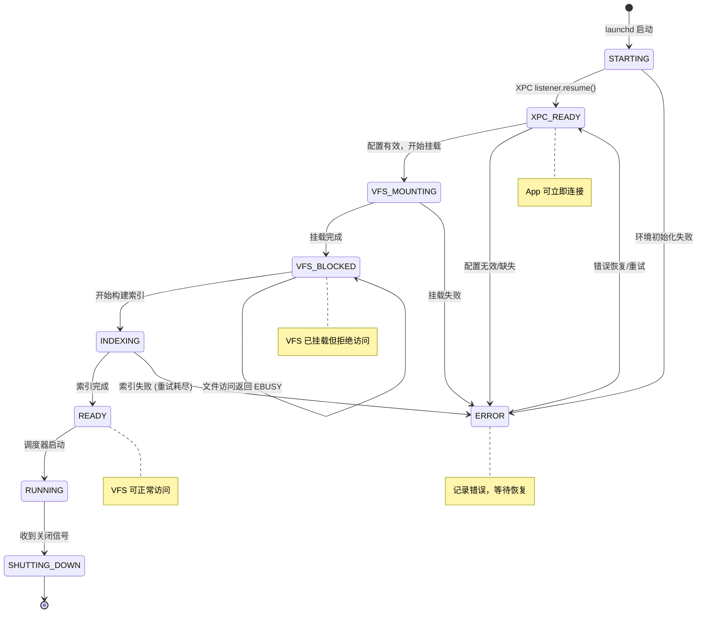

# 一、服务状态定义

> 返回 [目录](00_README.md)

---

## 1.1 全局服务状态

```swift
enum ServiceState: Int, Codable {
    case starting       = 0  // 进程启动中
    case xpcReady       = 1  // XPC 监听就绪，可接受连接
    case vfsMounting    = 2  // FUSE 挂载进行中
    case vfsBlocked     = 3  // FUSE 已挂载，索引未就绪，拒绝访问
    case indexing       = 4  // 正在构建文件索引
    case ready          = 5  // 索引完成，VFS 可正常访问
    case running        = 6  // 完全运行，调度器已启动
    case shuttingDown   = 7  // 正在关闭
    case error          = 99 // 错误状态
}
```

## 1.2 组件状态定义

```swift
/// 各组件独立状态
enum ComponentState: Int, Codable {
    case notStarted = 0    // 未启动
    case starting = 1      // 启动中
    case ready = 2         // 就绪
    case busy = 3          // 忙碌中 (正在执行任务)
    case paused = 4        // 暂停
    case error = 99        // 错误
}

/// 组件错误信息
struct ComponentError: Codable {
    let code: Int
    let message: String
    let timestamp: Date
    let recoverable: Bool   // 是否可恢复
    let context: [String: String]?  // 上下文信息
}
```

## 1.3 状态转换图



## 1.4 状态说明表

| 状态 | 值 | 说明 | App 可执行操作 |
|------|-----|------|---------------|
| `STARTING` | 0 | 进程启动中 | 无 |
| `XPC_READY` | 1 | XPC 就绪 | 状态查询、配置读写 |
| `VFS_MOUNTING` | 2 | 挂载中 | 状态查询、配置读写 |
| `VFS_BLOCKED` | 3 | 挂载完成，索引未就绪 | 状态查询、配置读写 |
| `INDEXING` | 4 | 构建索引中 | 状态查询、配置读写 |
| `READY` | 5 | 索引完成 | 全部操作 |
| `RUNNING` | 6 | 完全运行 | 全部操作 |
| `SHUTTING_DOWN` | 7 | 关闭中 | 无 |
| `ERROR` | 99 | 错误状态 | 状态查询、错误恢复 |

---

> 下一节: [02_配置管理](02_配置管理.md)
