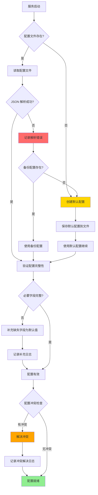
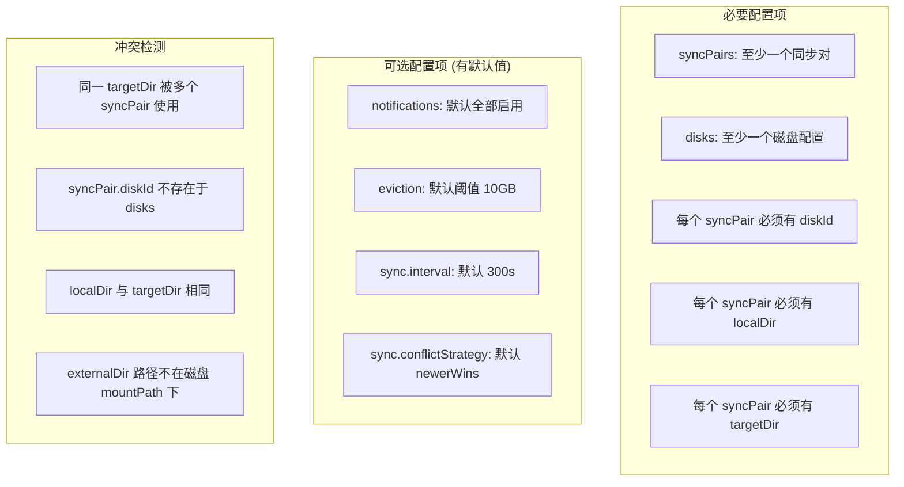
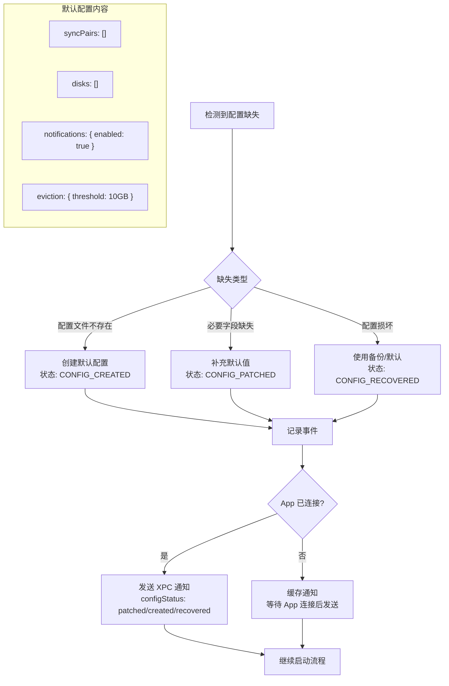
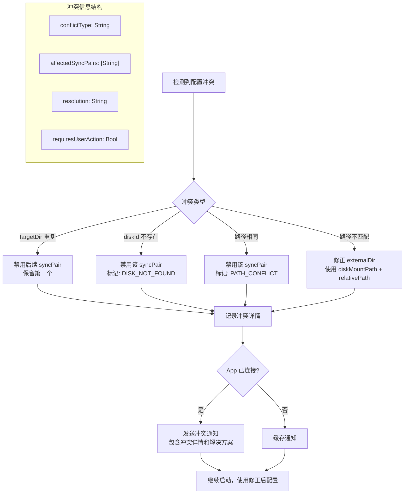

# 二、配置管理

> 返回 [目录](00_README.md) | 上一节: [01_服务状态定义](01_服务状态定义.md)

---

## 2.1 配置加载流程

```mermaid
flowchart TD
    A[服务启动] --> B{配置文件存在?}

    B -->|否| C[创建默认配置]
    B -->|是| D[读取配置文件]

    C --> E[保存默认配置到文件]
    E --> F[使用默认配置继续]

    D --> G{JSON 解析成功?}
    G -->|否| H[记录解析错误]
    H --> I{备份配置存在?}
    I -->|是| J[使用备份配置]
    I -->|否| C

    G -->|是| K[验证配置完整性]

    J --> K

    K --> L{必要字段完整?}
    L -->|否| M[补充缺失字段为默认值]
    M --> N[记录补充日志]
    N --> O[配置有效]

    L -->|是| O

    O --> P{配置冲突检查}
    P -->|有冲突| Q[解决冲突]
    Q --> R[记录冲突解决日志]
    R --> S[配置就绪]

    P -->|无冲突| S

    F --> K

    style C fill:#FFD700
    style H fill:#FF6B6B
    style Q fill:#FFA500
    style S fill:#90EE90
```

## 2.2 配置验证规则

```mermaid
flowchart TD
    subgraph Required["必要配置项"]
        R1["syncPairs: 至少一个同步对"]
        R2["disks: 至少一个磁盘配置"]
        R3["每个 syncPair 必须有 diskId"]
        R4["每个 syncPair 必须有 localDir"]
        R5["每个 syncPair 必须有 targetDir"]
    end

    subgraph Optional["可选配置项 (有默认值)"]
        O1["notifications: 默认全部启用"]
        O2["eviction: 默认阈值 10GB"]
        O3["sync.interval: 默认 300s"]
        O4["sync.conflictStrategy: 默认 newerWins"]
    end

    subgraph Conflicts["冲突检测"]
        C1["同一 targetDir 被多个 syncPair 使用"]
        C2["syncPair.diskId 不存在于 disks"]
        C3["localDir 与 targetDir 相同"]
        C4["externalDir 路径不在磁盘 mountPath 下"]
    end
```

## 2.3 配置缺失处理

```mermaid
flowchart TD
    A[检测到配置缺失] --> B{缺失类型}

    B -->|配置文件不存在| C["创建默认配置<br/>状态: CONFIG_CREATED"]
    B -->|必要字段缺失| D["补充默认值<br/>状态: CONFIG_PATCHED"]
    B -->|配置损坏| E["使用备份/默认<br/>状态: CONFIG_RECOVERED"]

    C --> F[记录事件]
    D --> F
    E --> F

    F --> G{App 已连接?}
    G -->|是| H["发送 XPC 通知<br/>configStatus: patched/created/recovered"]
    G -->|否| I["缓存通知<br/>等待 App 连接后发送"]

    H --> J[继续启动流程]
    I --> J

    subgraph DefaultConfig["默认配置内容"]
        DC1["syncPairs: []"]
        DC2["disks: []"]
        DC3["notifications: { enabled: true }"]
        DC4["eviction: { threshold: 10GB }"]
    end
```

## 2.4 配置冲突解决

```mermaid
flowchart TD
    A[检测到配置冲突] --> B{冲突类型}

    B -->|targetDir 重复| C["禁用后续 syncPair<br/>保留第一个"]
    B -->|diskId 不存在| D["禁用该 syncPair<br/>标记: DISK_NOT_FOUND"]
    B -->|路径相同| E["禁用该 syncPair<br/>标记: PATH_CONFLICT"]
    B -->|路径不匹配| F["修正 externalDir<br/>使用 diskMountPath + relativePath"]

    C --> G[记录冲突详情]
    D --> G
    E --> G
    F --> G

    G --> H{App 已连接?}
    H -->|是| I["发送冲突通知<br/>包含冲突详情和解决方案"]
    H -->|否| J["缓存通知"]

    I --> K[继续启动，使用修正后配置]
    J --> K

    subgraph ConflictInfo["冲突信息结构"]
        CI1["conflictType: String"]
        CI2["affectedSyncPairs: [String]"]
        CI3["resolution: String"]
        CI4["requiresUserAction: Bool"]
    end
```

---

> 下一节: [03_启动流程总览](03_启动流程总览.md)
