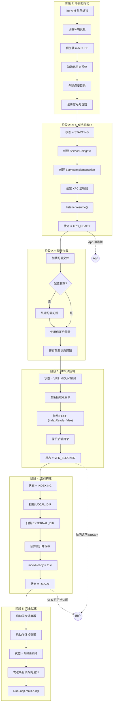

# 三、启动流程总览

> 返回 [目录](00_README.md) | 上一节: [02_配置管理](02_配置管理.md)

---

---

## 阶段说明

| 阶段 | 状态值 | 说明 | 详细文档 |
|------|--------|------|----------|
| 阶段 1 | STARTING (0) | 环境初始化，加载 macFUSE | - |
| 阶段 2 | XPC_READY (1) | XPC 监听器启动，App 可连接 | [06_XPC优先启动](06_XPC优先启动.md) |
| 阶段 2.5 | XPC_READY (1) | 配置加载和验证 | [02_配置管理](02_配置管理.md) |
| 阶段 3 | VFS_BLOCKED (3) | VFS 挂载但拒绝访问 | [07_VFS预挂载机制](07_VFS预挂载机制.md) |
| 阶段 4 | INDEXING (4) | 构建文件索引 | [08_索引构建流程](08_索引构建流程.md) |
| 阶段 5 | RUNNING (6) | 完全就绪，启动调度器 | [12_完整启动时序](12_完整启动时序.md) |

---

> 下一节: [04_XPC通信与通知](04_XPC通信与通知.md)
