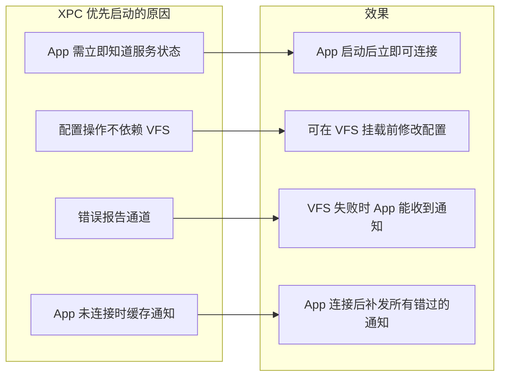
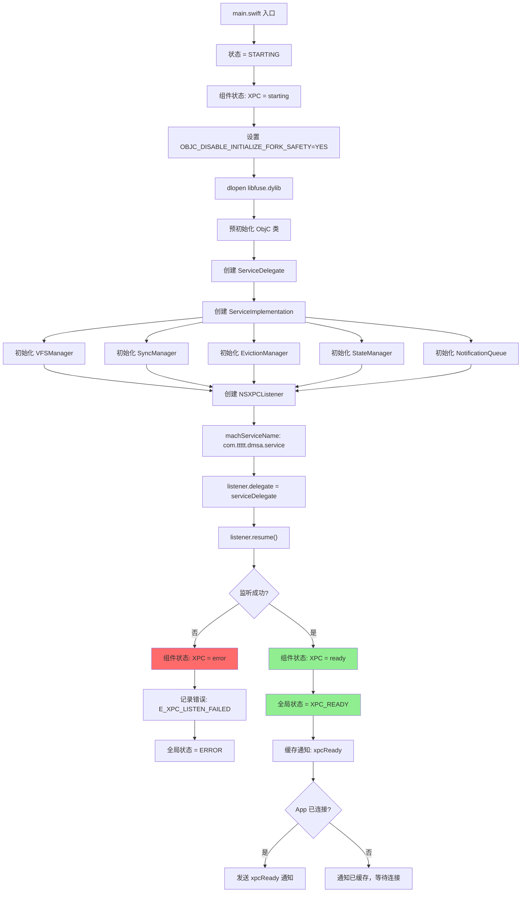
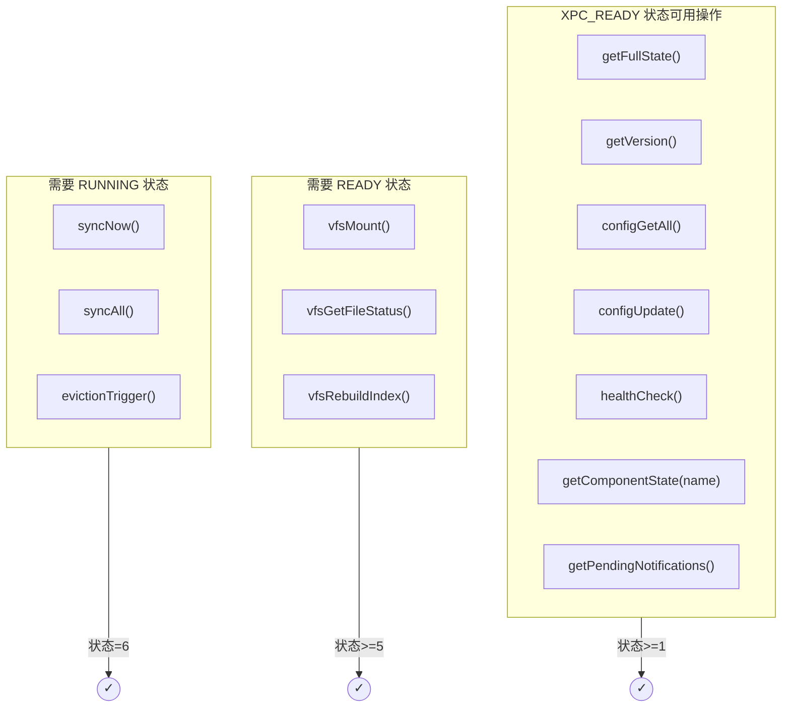

# 六、XPC 优先启动流程

> 返回 [目录](00_README.md) | 上一节: [05_状态管理器](05_状态管理器.md)

---

## 6.1 为什么 XPC 必须第一时间启动？

```mermaid
flowchart LR
    subgraph 原因["XPC 优先启动的原因"]
        A["App 需立即知道服务状态"]
        B["配置操作不依赖 VFS"]
        C["错误报告通道"]
        D["App 未连接时缓存通知"]
    end

    subgraph 效果["效果"]
        E["App 启动后立即可连接"]
        F["可在 VFS 挂载前修改配置"]
        G["VFS 失败时 App 能收到通知"]
        H["App 连接后补发所有错过的通知"]
    end

    A --> E
    B --> F
    C --> G
    D --> H
```

## 6.2 XPC 启动详细流程

```mermaid
flowchart TD
    A["main.swift 入口"] --> B["状态 = STARTING"]
    B --> B1["组件状态: XPC = starting"]

    B1 --> C["设置 OBJC_DISABLE_INITIALIZE_FORK_SAFETY=YES"]
    C --> D["dlopen libfuse.dylib"]
    D --> E["预初始化 ObjC 类"]

    E --> F[创建 ServiceDelegate]
    F --> G[创建 ServiceImplementation]

    G --> G1[初始化 VFSManager]
    G --> G2[初始化 SyncManager]
    G --> G3[初始化 EvictionManager]
    G --> G4[初始化 StateManager]
    G --> G5[初始化 NotificationQueue]

    G1 & G2 & G3 & G4 & G5 --> H["创建 NSXPCListener"]
    H --> I["machServiceName: com.ttttt.dmsa.service"]
    I --> J["listener.delegate = serviceDelegate"]
    J --> K["listener.resume()"]

    K --> L{监听成功?}
    L -->|否| L1["组件状态: XPC = error"]
    L1 --> L2["记录错误: E_XPC_LISTEN_FAILED"]
    L2 --> L3["全局状态 = ERROR"]

    L -->|是| M["组件状态: XPC = ready"]
    M --> N["全局状态 = XPC_READY"]
    N --> O["缓存通知: xpcReady"]

    O --> P{App 已连接?}
    P -->|是| Q[发送 xpcReady 通知]
    P -->|否| R[通知已缓存，等待连接]

    style M fill:#90EE90
    style N fill:#90EE90
    style L1 fill:#FF6B6B
```

## 6.3 XPC 就绪后可用的操作

```mermaid
flowchart TB
    subgraph XPC_READY["XPC_READY 状态可用操作"]
        A["getFullState()"]
        B["getVersion()"]
        C["configGetAll()"]
        D["configUpdate()"]
        E["healthCheck()"]
        F["getComponentState(name)"]
        G["getPendingNotifications()"]
    end

    subgraph READY["需要 READY 状态"]
        H["vfsMount()"]
        I["vfsGetFileStatus()"]
        J["vfsRebuildIndex()"]
    end

    subgraph RUNNING["需要 RUNNING 状态"]
        K["syncNow()"]
        L["syncAll()"]
        M["evictionTrigger()"]
    end

    XPC_READY -->|状态>=1| OK1((✓))
    READY -->|状态>=5| OK2((✓))
    RUNNING -->|状态=6| OK3((✓))
```

---

> 下一节: [07_VFS预挂载机制](07_VFS预挂载机制.md)
