# 七、VFS 预挂载机制

> 返回 [目录](00_README.md) | 上一节: [06_XPC优先启动](06_XPC优先启动.md)

---

## 7.1 预挂载目的

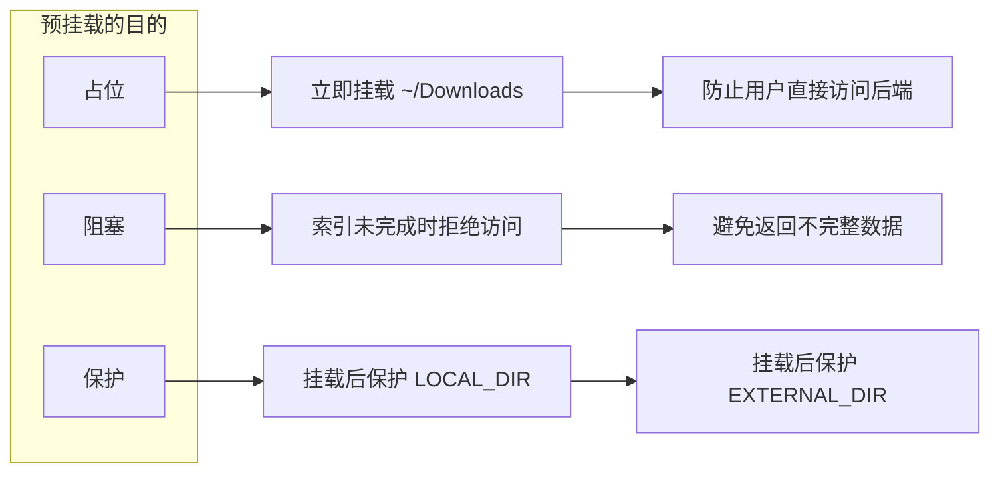

## 7.2 挂载流程详解

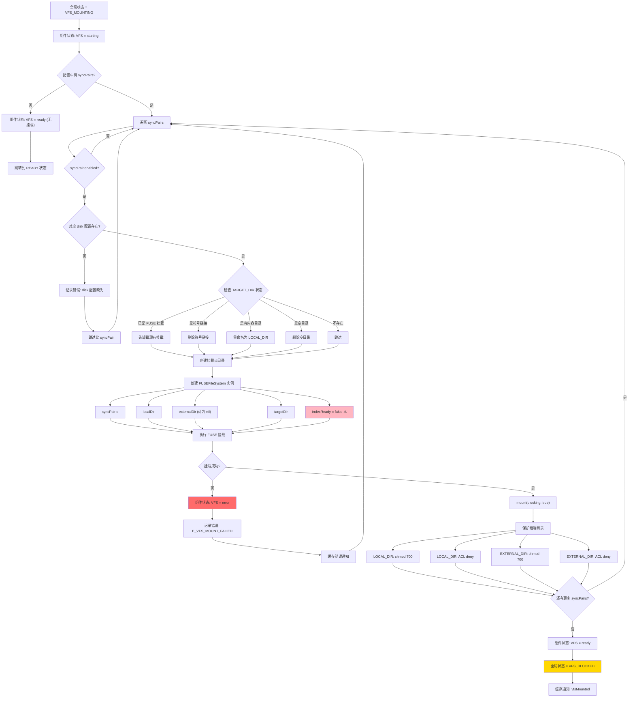

## 7.3 阻塞状态访问处理

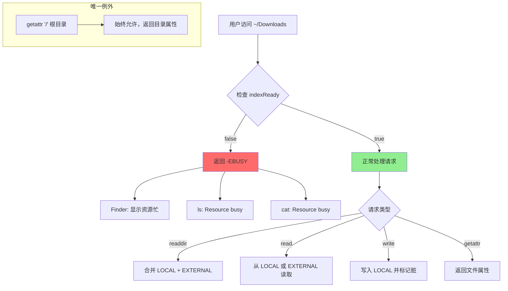

## 7.4 阻塞状态行为对照表

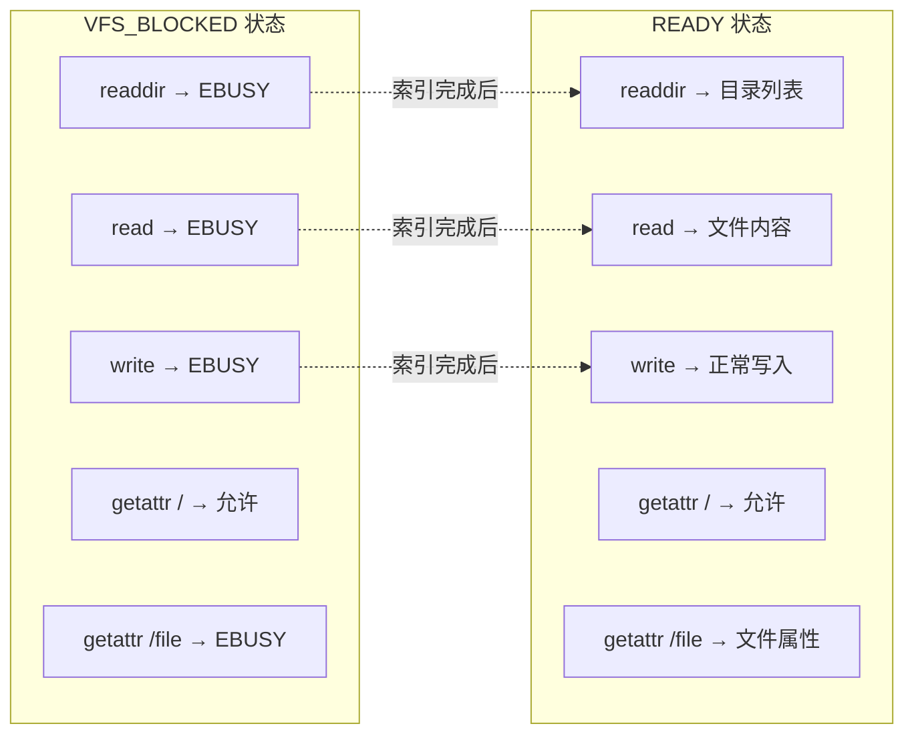

---

## 7.5 VFS 文件操作处理流程

当用户通过 `~/Downloads` (TARGET_DIR) 对文件进行操作时，VFS 层会拦截并处理这些操作。

### 7.5.1 操作类型总览

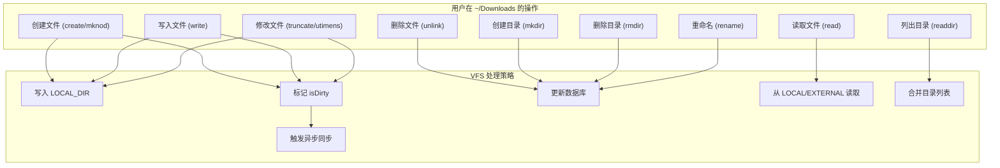

### 7.5.2 创建新文件流程 (create)

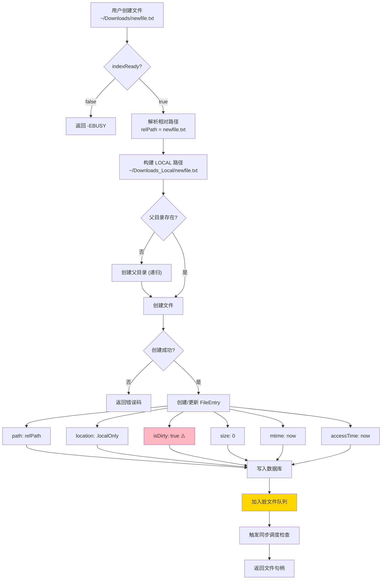

### 7.5.3 写入文件流程 (write)

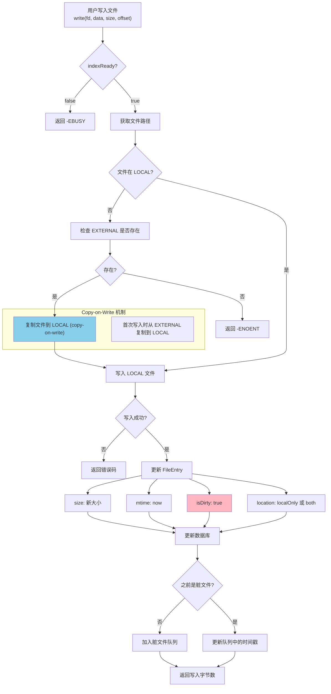

### 7.5.4 修改文件属性流程 (truncate/utimens)

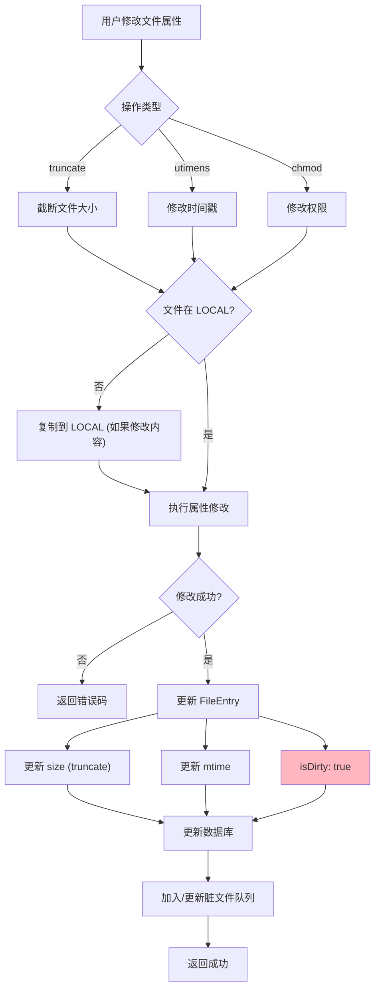

### 7.5.5 删除文件流程 (unlink)

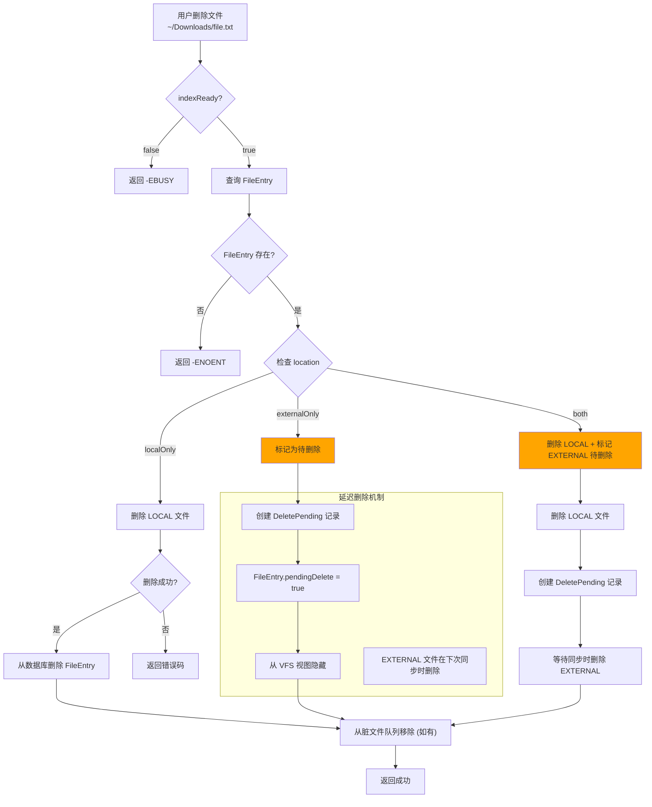

### 7.5.6 删除待同步处理

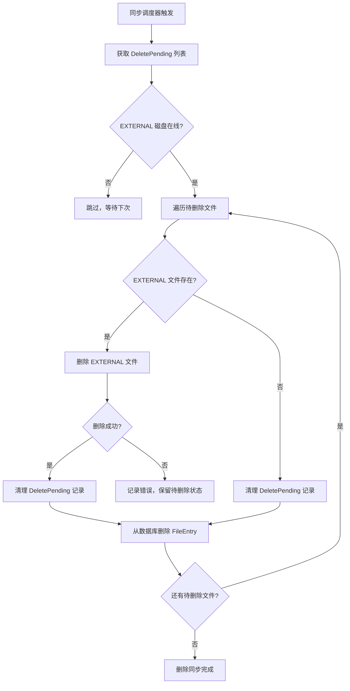

### 7.5.7 创建目录流程 (mkdir)

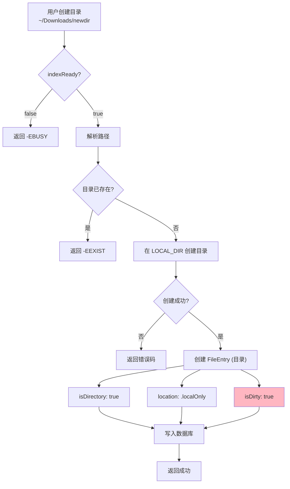

### 7.5.8 删除目录流程 (rmdir)

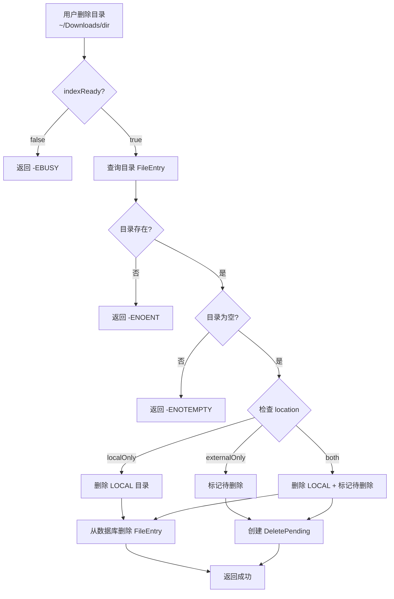

### 7.5.9 重命名流程 (rename)

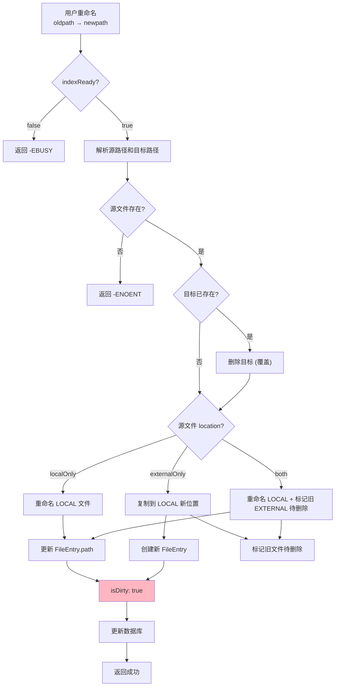

### 7.5.10 读取文件流程 (read)

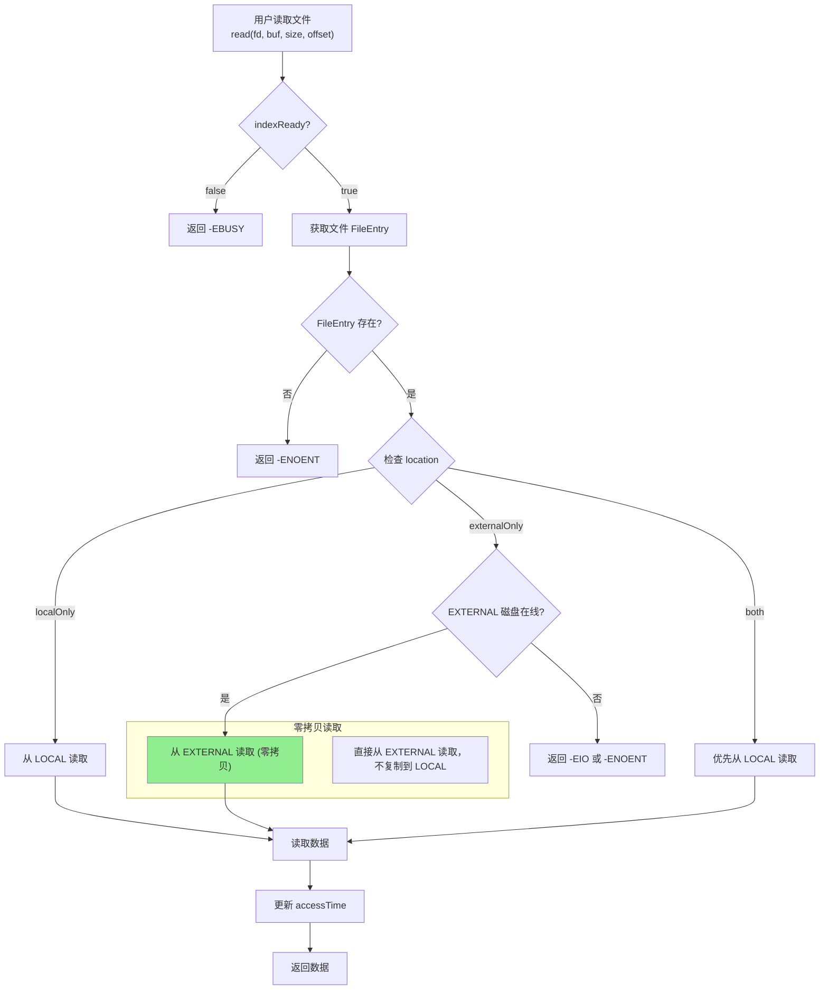

### 7.5.11 列出目录流程 (readdir)

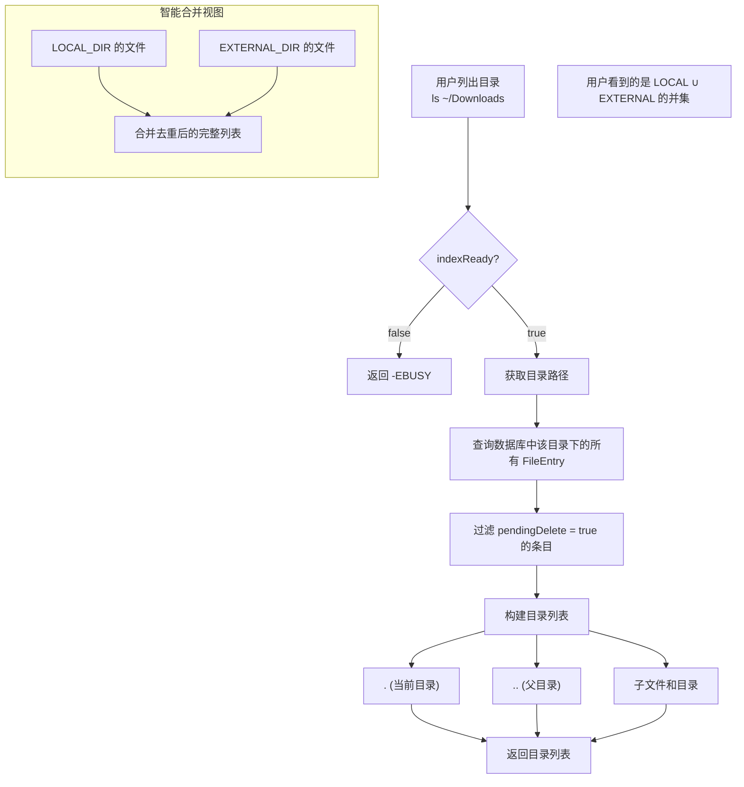

### 7.5.12 文件操作与同步的关系

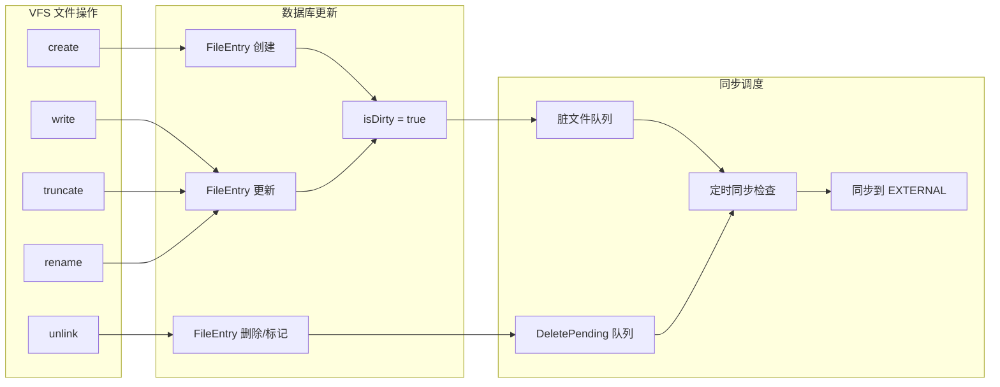

### 7.5.13 操作错误码对照表

| 操作 | 错误场景 | 返回码 | 说明 |
|------|----------|--------|------|
| 所有操作 | 索引未就绪 | `-EBUSY` | 等待索引完成 |
| create | 文件已存在 | `-EEXIST` | 文件名冲突 |
| create | 磁盘空间不足 | `-ENOSPC` | LOCAL 空间不足 |
| write | 文件不存在 | `-ENOENT` | 文件被删除 |
| write | 磁盘空间不足 | `-ENOSPC` | 触发紧急淘汰 |
| read | 文件不存在 | `-ENOENT` | 文件被删除 |
| read | EXTERNAL 离线 | `-EIO` | 仅外部文件时 |
| unlink | 文件不存在 | `-ENOENT` | - |
| rmdir | 目录不存在 | `-ENOENT` | - |
| rmdir | 目录非空 | `-ENOTEMPTY` | 需先删除内容 |
| rename | 源文件不存在 | `-ENOENT` | - |
| mkdir | 目录已存在 | `-EEXIST` | - |

---

> 下一节: [08_索引构建流程](08_索引构建流程.md)
