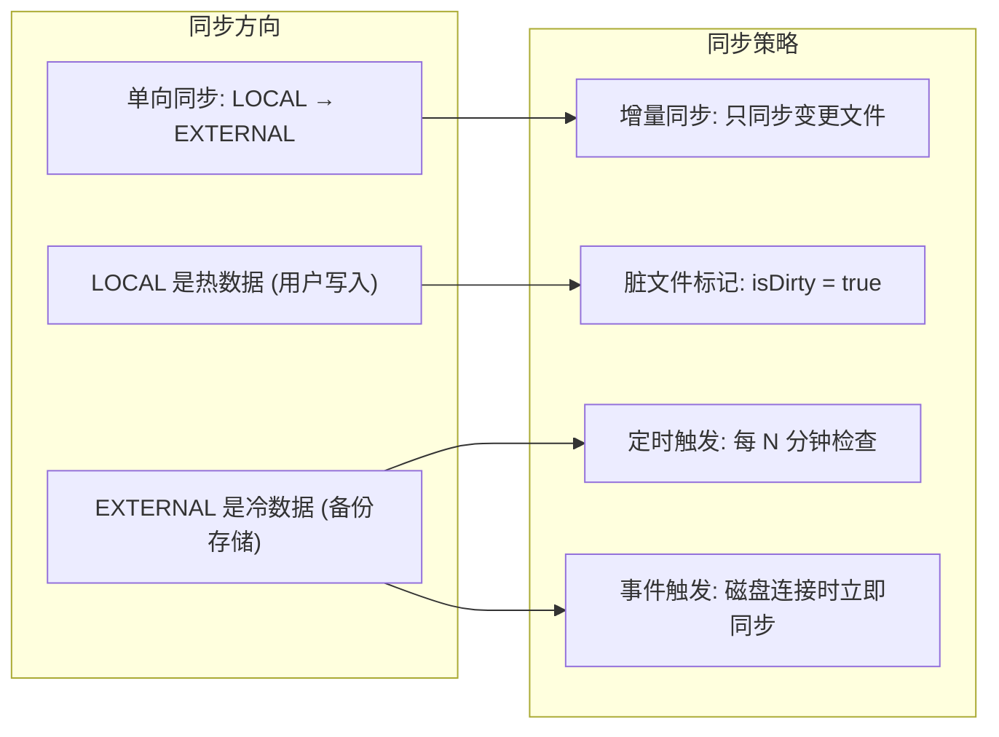
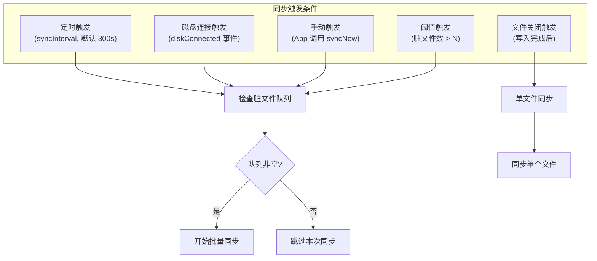
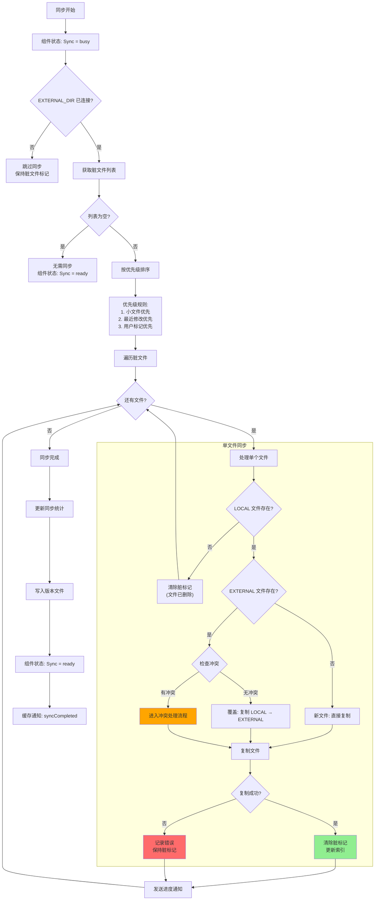
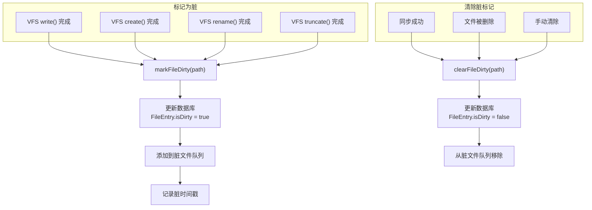
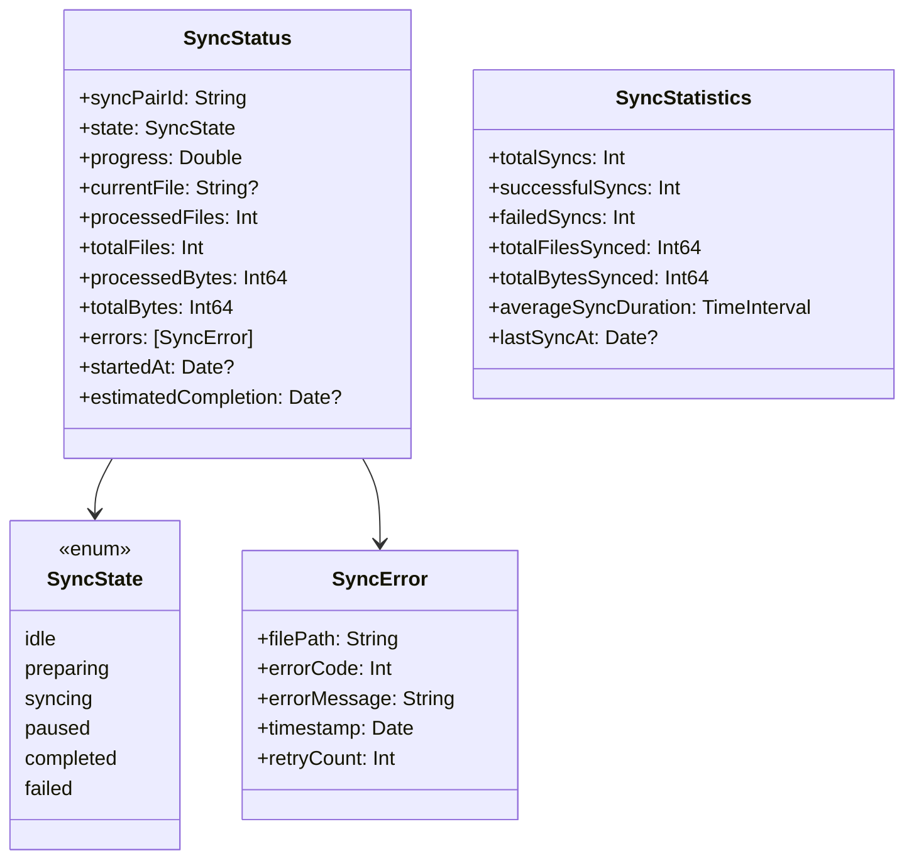
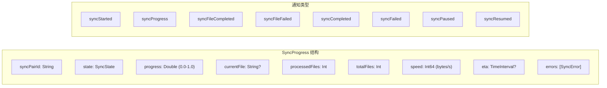

# 九、文件同步流程

> 返回 [目录](00_README.md) | 上一节: [08_索引构建流程](08_索引构建流程.md)

---

## 9.1 同步方向与策略

## 9.2 同步触发条件

## 9.3 同步主流程

## 9.4 脏文件管理

## 9.5 同步状态结构

## 9.6 同步进度通知

---

> 下一节: [10_冲突处理流程](10_冲突处理流程.md)
