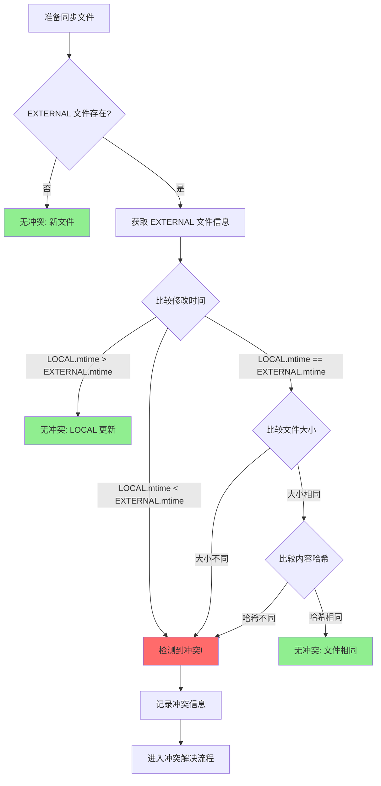
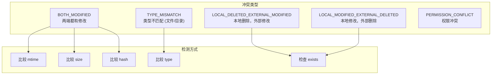
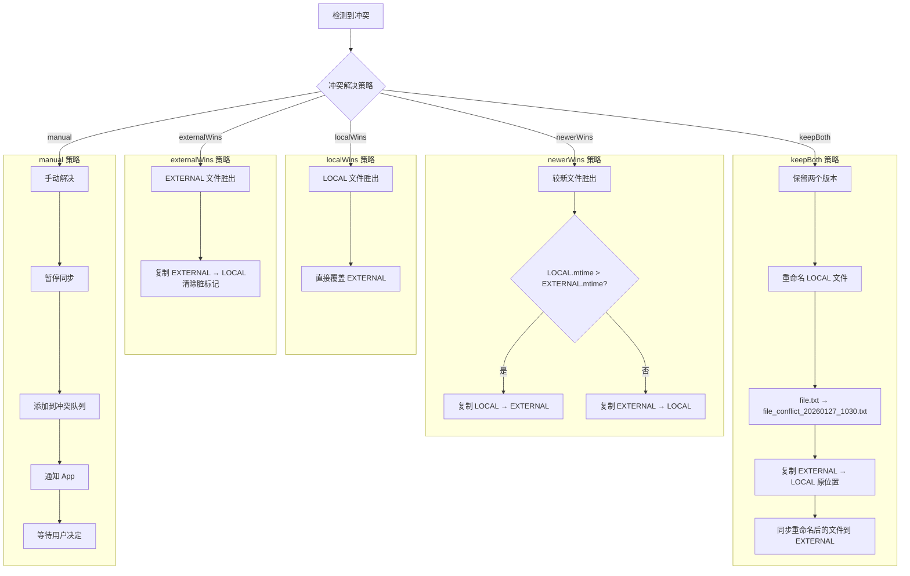
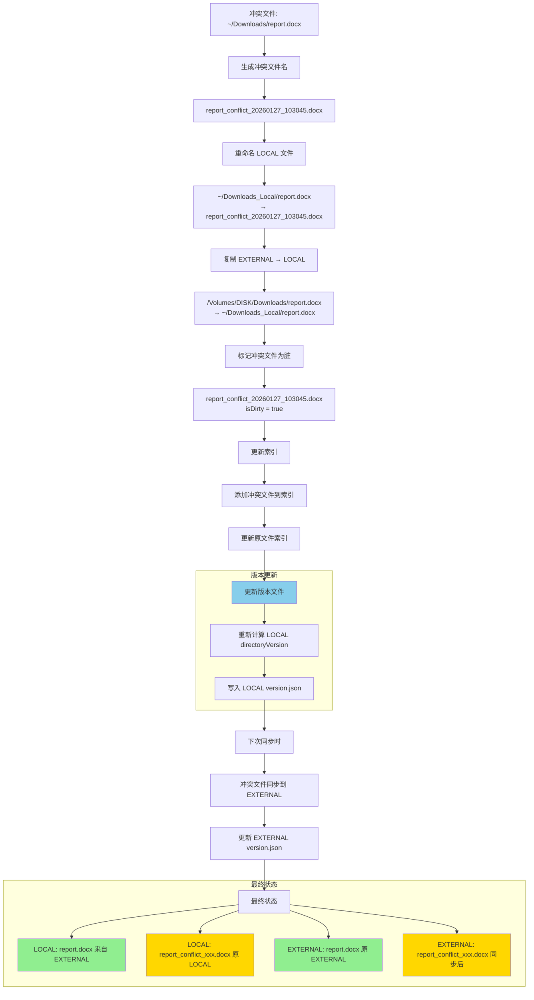
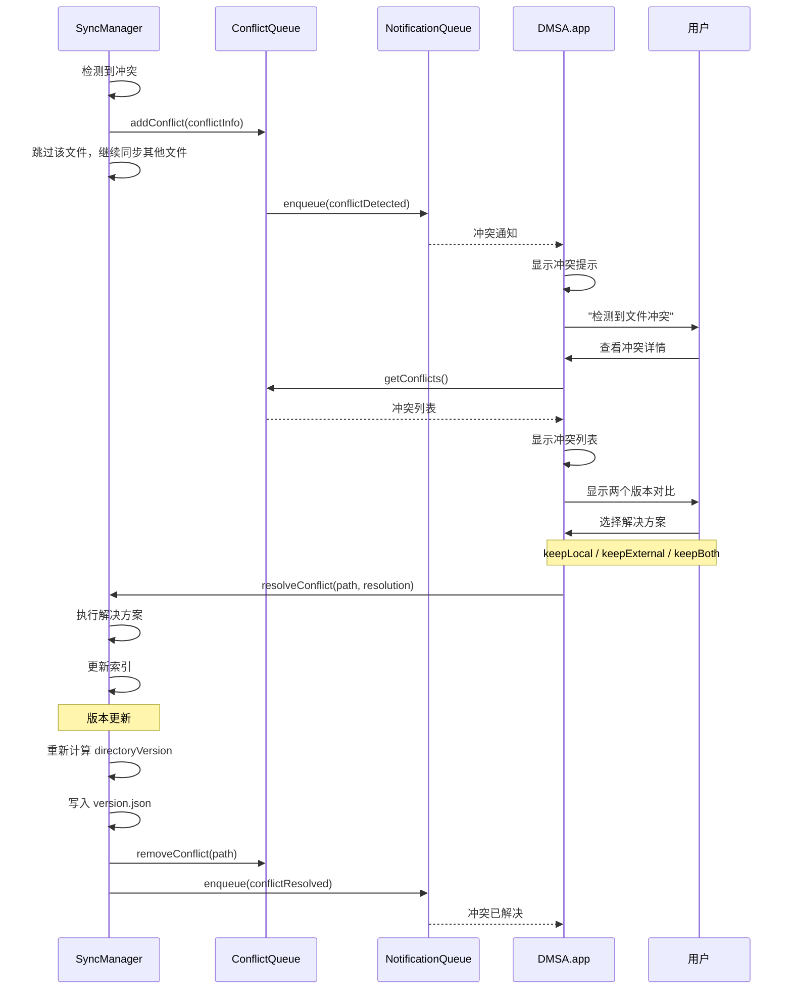
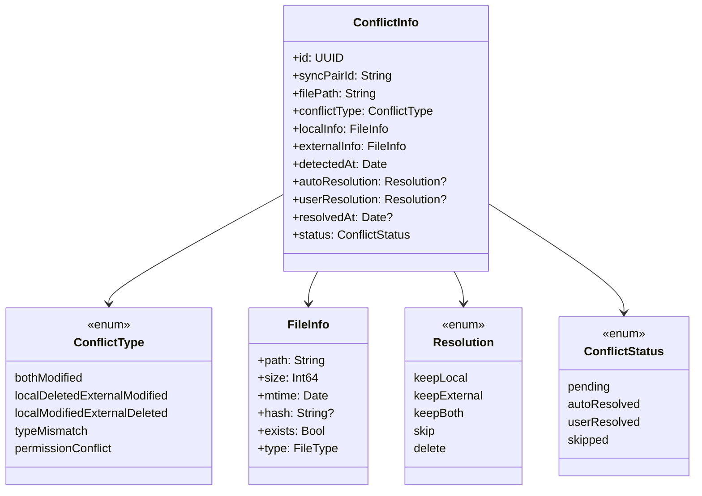
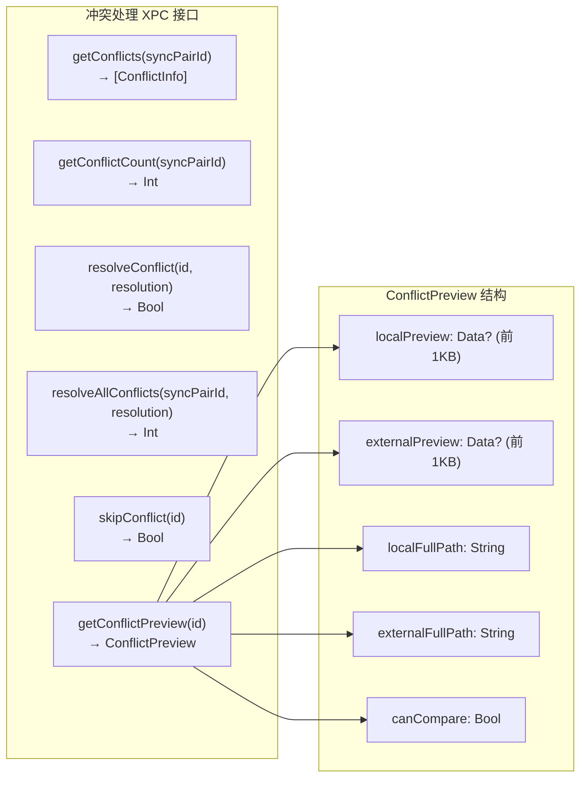

# 十、冲突处理流程

> 返回 [目录](00_README.md) | 上一节: [09_文件同步流程](09_文件同步流程.md)

---

## 10.1 冲突检测

## 10.2 冲突类型

## 10.3 冲突解决策略

## 10.4 冲突解决流程 (keepBoth)

## 10.5 冲突解决流程 (manual)

## 10.6 冲突信息结构

## 10.7 冲突处理 XPC 接口

---

> 下一节: [11_热数据淘汰流程](11_热数据淘汰流程.md)
