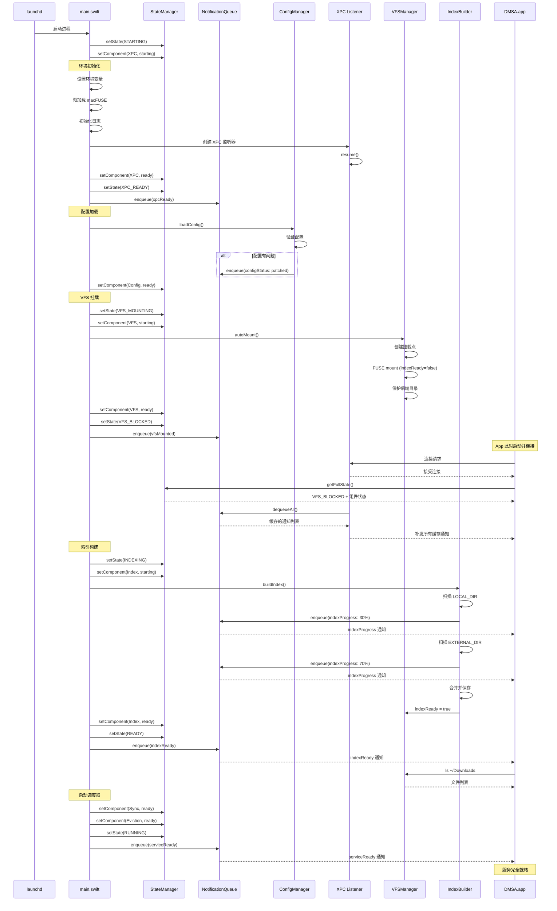

# 十二、完整启动时序

> 返回 [目录](00_README.md) | 上一节: [11_热数据淘汰流程](11_热数据淘汰流程.md)

---

---

## 启动时间参考

| 阶段 | 耗时 | 说明 |
|------|------|------|
| 环境初始化 | ~50ms | 设置环境变量、加载 macFUSE |
| XPC 启动 | ~50ms | 创建监听器并启动 |
| 配置加载 | ~50ms | 读取、验证配置 |
| VFS 挂载 | ~100ms | FUSE 挂载、保护目录 |
| 索引构建 | ~1-10s | 取决于文件数量 |
| 调度器启动 | ~50ms | 启动同步和淘汰调度 |
| **总计** | **~2-12s** | - |

---

> 下一节: [13_App端交互流程](13_App端交互流程.md)
