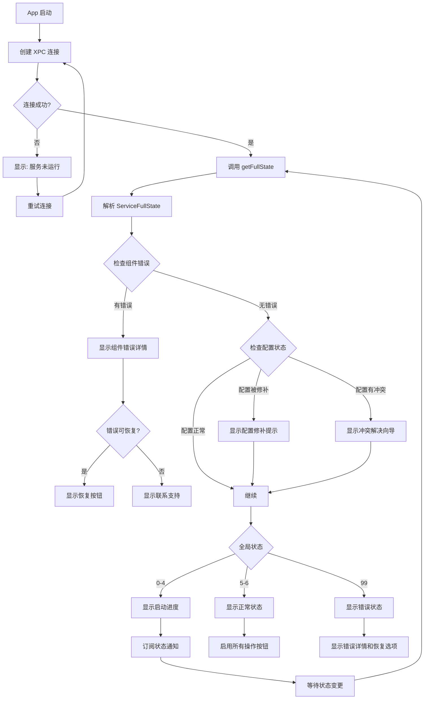
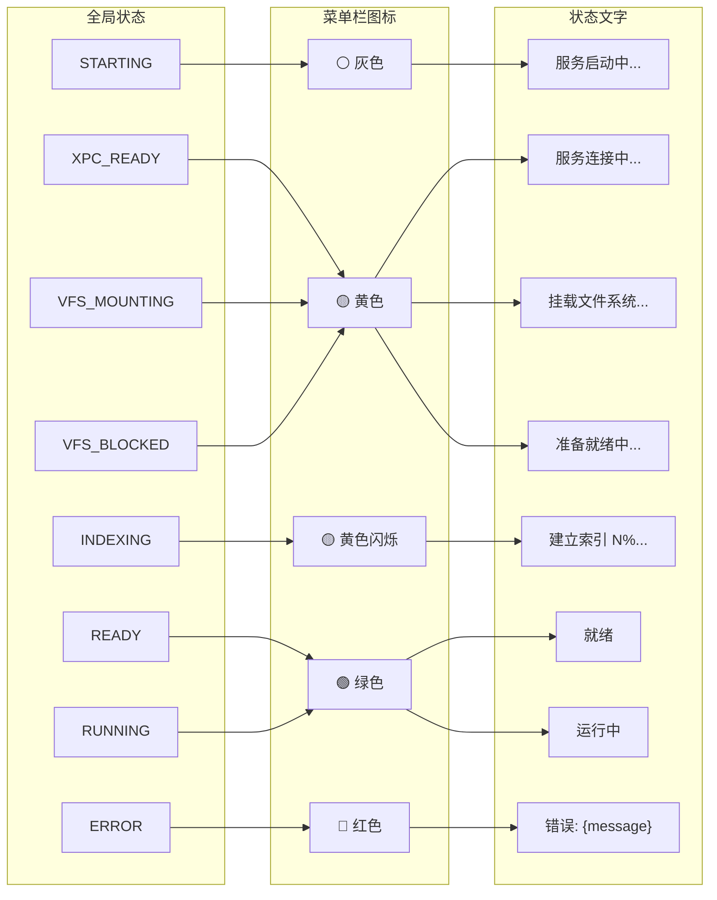

# 十三、App 端交互流程

> 返回 [目录](00_README.md) | 上一节: [12_完整启动时序](12_完整启动时序.md)

---

## 13.1 App 启动流程

## 13.2 App UI 状态映射

## 13.3 状态与 UI 对照表

| 全局状态 | 值 | 图标 | 状态文字 | 可用操作 |
|----------|-----|------|----------|----------|
| STARTING | 0 | ⚪ 灰色 | 服务启动中... | 无 |
| XPC_READY | 1 | 🟡 黄色 | 服务连接中... | 查看状态、修改配置 |
| VFS_MOUNTING | 2 | 🟡 黄色 | 挂载文件系统... | 查看状态、修改配置 |
| VFS_BLOCKED | 3 | 🟡 黄色 | 准备就绪中... | 查看状态、修改配置 |
| INDEXING | 4 | 🟡 黄色闪烁 | 建立索引 N%... | 查看状态、修改配置 |
| READY | 5 | 🟢 绿色 | 就绪 | 全部操作 |
| RUNNING | 6 | 🟢 绿色 | 运行中 | 全部操作 |
| ERROR | 99 | 🔴 红色 | 错误: {message} | 查看错误、尝试恢复 |

---

> 下一节: [14_分布式通知](14_分布式通知.md)
